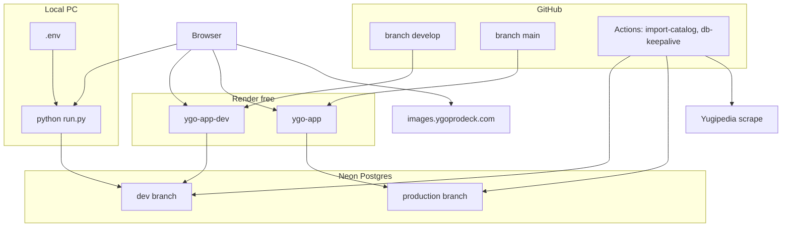

# Agent handoff — YGO Collection & Deck Builder

**Last updated:** 2026-06-03  
**Purpose:** Onboard the next agent/session without re-reading full chat history. Keep this file updated when architecture or deploy steps change.

Also referenced in user rules as `agend_handoff.md` (same content; use this path).

---

## 1. Project summary

| Item | Detail |
|------|--------|
| **What** | Browser UI + FastAPI API for Yu-Gi-Oh! card search, per-user collection (set code + rarity), decks, favorites, tags |
| **Stack** | Python 3.12, FastAPI, SQLAlchemy 2, Pydantic, static HTML/JS, Alembic, `python-dotenv` |
| **Local DB (fallback)** | SQLite `data/ygo.db` when `DATABASE_URL` unset in `.env` |
| **Recommended local** | Neon **dev** branch via `.env` (`ENV=production`) — see [`docs/LOCAL_DEV.md`](docs/LOCAL_DEV.md) |
| **Cloud DB** | PostgreSQL on **Neon** (pooled URL, `sslmode=require`) — not Render Postgres |
| **Card images** | **CDN only** — YGOProDeck URLs; browser loads `images.ygoprodeck.com` |
| **Auth** | JWT (`SECRET_KEY` signs tokens; bcrypt for passwords) |

### Environments (three tiers)

| Tier | Git branch | Render service | Neon branch |
|------|------------|----------------|-------------|
| **Local** | any | — (`python run.py`) | **dev** (`.env`) |
| **Staging** | `develop` | `ygo-app-dev` | **dev** |
| **Production** | `main` | `ygo-app` | **main** (production) |

Full workflow: [`docs/ENVIRONMENTS.md`](docs/ENVIRONMENTS.md).

### Status snapshot

| Component | Notes |
|-----------|--------|
| Neon prod | ~**14,371** cards (catalog import) |
| Neon dev | Separate branch; same schema; own users/data |
| GitHub | `develop` + `main` on origin; secrets `DATABASE_URL`, `DATABASE_URL_DEV` |
| Render | Dual services in [`render.yaml`](render.yaml); user sets `DATABASE_URL` per service in Dashboard |
| UI search | Paginated (500/page); batch owned/favorite queries on search API |

---

## 2. Architecture



### Free permanent cloud

| Piece | File / service |
|-------|----------------|
| Staging web | `ygo-app-dev` — branch **`develop`** |
| Production web | `ygo-app` — branch **`main`** |
| Blueprint | [`render.yaml`](render.yaml), alias [`render-free.yaml`](render-free.yaml) |
| DB | Neon pooled URLs (never Render free Postgres — 30-day expiry) |
| Catalog | [`.github/workflows/import-catalog-yugipedia.yml`](.github/workflows/import-catalog-yugipedia.yml) — scrape + import; **1st & 15th** monthly (prod); manual prod/dev; fallback: [`import-catalog-ygoprodeck.yml`](.github/workflows/import-catalog-ygoprodeck.yml) |
| DB ping | [`.github/workflows/db-keepalive.yml`](.github/workflows/db-keepalive.yml) — prod + dev jobs |
| Docs | [`docs/ENVIRONMENTS.md`](docs/ENVIRONMENTS.md), [`docs/LOCAL_DEV.md`](docs/LOCAL_DEV.md), [`docs/DEPLOY_FREE.md`](docs/DEPLOY_FREE.md) |

### Paid alternative

[`render-paid.yaml`](render-paid.yaml) — Starter web + Render Postgres + cron. **Do not** use for the free Neon stack.

---

## 3. Git workflow (layman)

| Action | Effect |
|--------|--------|
| **commit** | Save snapshot locally |
| **push `develop`** | Updates GitHub → deploys **staging** only |
| **merge `develop` → `main`** | Promotes code → deploys **production** |
| **pull** | Download latest from GitHub |

Day-to-day: work on `develop` → push → test staging URL → PR/merge to `main` → smoke-test prod.

`.env` is **gitignored**; never commit secrets.

---

## 4. Repository layout (important paths)

```
ygo_app/
  yugipedia/             # passcodes, details scrape, adapter, CDN image URLs
  jobs/                  # scrape_yugipedia_catalog, import_catalog_yugipedia
  config.py              # load_dotenv; ENV, DATABASE_URL, search limits
  database.py            # pool_pre_ping on Postgres; SQLite pragmas
  api/main.py, routes/   # FastAPI; DevStaticFiles vs cached static by ENV
  import_data.py         # CSV import; Path(str) for upload temp files
  services.py            # card_summaries_batch (search N+1 fix)
  auth.py                # JWT + bcrypt
  static/js/app.js       # Search pagination; fetchSearchPage 500 limit
alembic/versions/        # 001 initial, 002 rarity widen
render.yaml              # ygo-app-dev (develop) + ygo-app (main)
.env.example             # prod-parity template; copy to .env
docs/
  ENVIRONMENTS.md        # staging/prod promotion
  LOCAL_DEV.md           # Neon dev + .env
  DEPLOY_FREE.md         # Neon + Render + GHA setup
.github/workflows/
run.py                   # dotenv; startup ENV/db summary
```

---

## 5. What was implemented (recent sessions)

### Infrastructure and dev experience

1. **Prod-parity local:** `python-dotenv`, `.env` + Neon dev branch, [`docs/LOCAL_DEV.md`](docs/LOCAL_DEV.md).
2. **Three-tier deploy:** `develop` → `ygo-app-dev`; `main` → `ygo-app`; [`docs/ENVIRONMENTS.md`](docs/ENVIRONMENTS.md).
3. **Dual GitHub secrets:** `DATABASE_URL` (prod), `DATABASE_URL_DEV` (dev); import workflow `environment` input; keepalive pings both.

### App fixes (prod + local)

4. **Search at scale:** Client loads one page (500 cards), pagination UI; no full-catalog fetch (~29 requests).
5. **Search API:** `card_summaries_batch()` — batch owned/favorite instead of per-card DB queries.
6. **Postgres pool:** `pool_pre_ping=True`, `pool_recycle=300` in [`database.py`](ygo_app/database.py).
7. **CSV import:** `import_collection_csv(Path | str)` — fixes 500 when API passed temp path string.

### Earlier (still relevant)

8. Cloud refactor, CDN images, Alembic bootstrap, rarity `String(64)` + migration `002`, GHA catalog import.

### Yugipedia catalog (2026-06-03)

9. **Catalog source:** Yugipedia scrape → `data/catalog/*.json` → DB (printings include multi-rarity per set code).
10. **CLI:** `python -m ygo_app.jobs.scrape_yugipedia_catalog --full` then `import_catalog_yugipedia`.
11. **Multi-rarity fix:** `extract_rarities_from_cell` uses all `<a>` in rarity column (not `<br>` split).

---

## 6. Resolved issues (reference)

| Issue | Fix |
|-------|-----|
| Stuck on "Searching…" on Render | Paginated search + batch summaries (14k cards) |
| CSV import Internal Server Error | `Path(path)` in `import_collection_csv` |
| `varchar(16)` on import | Migration `002`, model `String(64)` |
| `users already exists` on migrate | `stamp_legacy_schema_if_needed` in `alembic/env.py` |
| Idle Neon connections | `pool_pre_ping` |

### If catalog empty

1. Match `DATABASE_URL` on Render service to the Neon branch used for import.
2. Run **Import Yugipedia catalog** (correct environment: prod vs dev).
3. `GET /api/status` → `cards` ~14k.

---

## 7. Commands cheat sheet

### Local (recommended — Neon dev)

```powershell
cd "c:\Python Projects\YGO App Cursor"
pip install -r requirements.txt
copy .env.example .env   # ENV=production, DATABASE_URL=dev branch, SECRET_KEY=any
alembic upgrade head
python -m ygo_app.jobs.import_catalog_yugipedia   # after scrape, or use YGOProDeck: import_catalog
python run.py              # or: python run.py --reload
```

### Git (typical)

```powershell
git checkout develop
git add -A && git commit -m "message"
git push
# after staging OK:
git checkout main && git merge develop && git push
```

### GitHub Actions

- **Import Yugipedia catalog** → choose **production** or **dev** (optional: skip scrape, import-only)
- **Import YGO catalog (YGOProDeck API fallback)** → emergency rollback
- **Neon DB keep-alive** — both DBs (needs both secrets)

### Render build (automatic on deploy)

`pip install -r requirements.txt && alembic upgrade head`  
`uvicorn ygo_app.api.main:app --host 0.0.0.0 --port $PORT`

---

## 8. Environment variables

| Variable | Local (`.env`) | Render / GHA |
|----------|----------------|--------------|
| `DATABASE_URL` | Neon **dev** pooled URL | **ygo-app-dev:** dev URL · **ygo-app:** prod URL |
| `DATABASE_URL_DEV` | — | GitHub Actions dev jobs only |
| `ENV` | `production` (parity) or unset → `development` + SQLite | `production` |
| `SECRET_KEY` | any local string | per-service on Render (`generateValue`) |
| `PORT` | `8000` | `$PORT` |

Loaded from project-root `.env` via `load_dotenv` in [`config.py`](ygo_app/config.py) and [`run.py`](run.py). See [`.env.example`](.env.example).

**Search limits** when `ENV=production`: default 200, max 500 per request (matches UI `SEARCH_PAGE_SIZE`).

---

## 9. Deploy / setup checklist

| Step | Action |
|------|--------|
| 1 | Neon: **main** + **dev** branches; pooled URLs |
| 2 | GitHub secrets: `DATABASE_URL`, `DATABASE_URL_DEV` |
| 3 | Git: `main` + `develop` on origin |
| 4 | Import catalog on prod (and dev if empty) |
| 5 | Render: **ygo-app** (`main`, prod URL) + **ygo-app-dev** (`develop`, dev URL) |
| 6 | Local `.env` → dev URL for daily coding |
| 7 | Verify staging → merge to `main` → verify prod |

---

## 10. Suggested next tasks

1. Confirm Render **ygo-app-dev** exists and staging URL works after push to `develop`.
2. Optional: GitHub branch protection on `main` (PR required).
3. Optional: disable auto-deploy on prod Render for manual promote after merge.
4. Yugipedia catalog runs on schedule (1st & 15th); manual re-run when printings should refresh.

---

## 11. Do not do without user ask

- Edit `.cursor/plans/*.plan.md` files
- Run deprecated `get_images.py` (use `ygo_app.yugipedia.images` URL builder instead)
- Use Render free Postgres (30-day expiry)
- Commit `.env` or real `DATABASE_URL` / secrets to git
- Use `render-paid.yaml` for the free Neon stack
- Push experimental work directly to `main` (use `develop`)

---

## 12. Quick verification

| Check | Expected |
|-------|----------|
| `GET /api/health` | `{"ok": true}` |
| `GET /api/status` | `ready: true`, `cards` ~**14371** |
| Search UI | "Page 1 of N" with ~500 cards per page |
| CSV import (logged in) | Success alert; no 500 |
| `python run.py` startup | `ENV=production · database=postgres · http://127.0.0.1:8000/` (with `.env`) |
