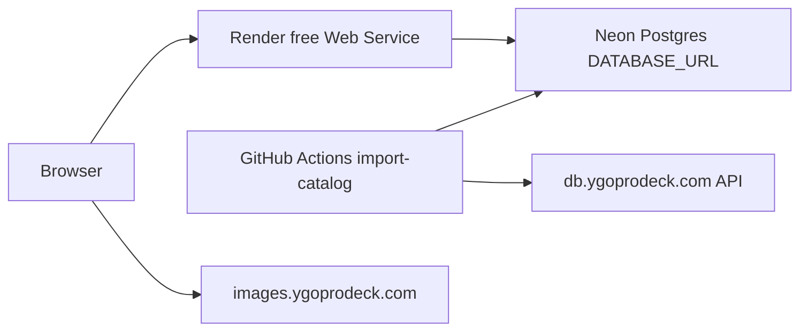

# Agent handoff — YGO Collection & Deck Builder

**Last updated:** 2026-06-01  
**Purpose:** Onboard the next agent/session without re-reading full chat history. Keep this file updated when architecture or deploy steps change.

Also referenced in user rules as `agend_handoff.md` (same content; use this path).

---

## 1. Project summary

| Item | Detail |
|------|--------|
| **What** | Browser UI + FastAPI API for Yu-Gi-Oh! card search, per-user collection (set code + rarity), decks, favorites, tags |
| **Stack** | Python 3.12, FastAPI, SQLAlchemy 2, Pydantic, static HTML/JS, Alembic |
| **Local DB** | SQLite `data/ygo.db` when `DATABASE_URL` unset |
| **Cloud DB** | PostgreSQL on **Neon** (pooled URL, `sslmode=require`) — not Render Postgres |
| **Card images** | **CDN only** — `image_url` / `image_url_small` from YGOProDeck; browser loads `images.ygoprodeck.com`. No local JPGs in app. |
| **Auth** | JWT (bcrypt + python-jose); register/login in UI header |

### Production status (user-confirmed)

| Component | Status |
|-----------|--------|
| Neon Postgres | Ready (~**14,371** cards in catalog) |
| GitHub **Import YGO catalog** | Succeeded (migrations + import) |
| Render Blueprint (`render.yaml`) | Ready (free `ygo-app` web service) |
| **Next for user** | Set `DATABASE_URL` on Render if not done; verify `/api/status`; register; import collection CSV |

---

## 2. Architecture



### Free permanent cloud (active setup)

| Piece | File / service |
|-------|----------------|
| Web | [`render.yaml`](render.yaml) — default Blueprint, `plan: free`; set `DATABASE_URL` in Render Dashboard |
| DB | Neon pooled connection string |
| Catalog seed | [`.github/workflows/import-catalog.yml`](.github/workflows/import-catalog.yml) |
| DB ping | [`.github/workflows/db-keepalive.yml`](.github/workflows/db-keepalive.yml) (every 3 days) |
| Docs | [`docs/DEPLOY_FREE.md`](docs/DEPLOY_FREE.md) |
| Blueprint alias | [`render-free.yaml`](render-free.yaml) — same as `render.yaml` |

### Paid alternative

[`render-paid.yaml`](render-paid.yaml) — Starter web + Render Postgres (`databases:`) + monthly `type: cron` import (not $0). Do **not** use for free stack.

---

## 3. Repository layout (important paths)

```
ygo_app/
  api/main.py, api/routes/     # FastAPI app; startup calls init_db() (search index only on Postgres)
  models.py                    # SQLAlchemy models (multi-user); rarity columns String(64)
  database.py                  # ENGINE; Neon SSL via connect_args
  import_data.py               # JSON/API/CSV import; create_all only on SQLite
  migration_bootstrap.py       # Stamps Alembic if tables exist without alembic_version
  jobs/import_catalog.py       # GHA entrypoint
  services.py, search_index.py # Search: SQLite FTS5 vs Postgres to_tsvector
  auth.py                      # JWT + bcrypt
  static/                      # UI
alembic/versions/
  001_initial_multiuser.py     # Full schema; printings already use VARCHAR(64) in 001
  002_widen_rarity_code.py     # Alters 16→64 for DBs created before model fix
alembic/env.py                 # Calls stamp_legacy_schema_if_needed before migrate
render.yaml                    # Free web Blueprint (Render default)
render-paid.yaml               # Paid Blueprint
render-free.yaml               # Alias of render.yaml
docs/DEPLOY_FREE.md
.github/workflows/
```

---

## 4. What was implemented (recent sessions)

1. **Cloud-ready refactor:** env config ([`ygo_app/config.py`](ygo_app/config.py)), multi-user models, JWT auth, per-user collection/decks/favorites/tags.
2. **Image strategy:** CDN-only; deprecated `ygopro/get_images.py` and `yugipedia/get_images.py`.
3. **Permanent free stack:** Neon + Render free + GitHub Actions catalog import.
4. **Import from API:** `python -m ygo_app.jobs.import_catalog` (no `all_cards.json` on server).
5. **Rarity column fix:** `String(64)` + migration `002`; GHA runs `alembic upgrade head` before import.
6. **Alembic bootstrap:** [`migration_bootstrap.py`](ygo_app/migration_bootstrap.py) stamps `001` or `002` when schema was created via `create_all` (fixes `DuplicateTable: users` on deploy).
7. **Postgres schema:** `init_db()` skips `create_all` on Postgres; Alembic owns cloud DDL.
8. **Render Blueprint fix:** Root `render.yaml` = free web only; paid stack moved to `render-paid.yaml` with valid `databases:` + `type: cron` (old `render.yaml` had invalid `pserv`/`jobs` keys).

---

## 5. Resolved issues (reference)

### GitHub import — `varchar(16)` truncation (fixed)

- **Was:** `StringDataRightTruncation` on long synthesized rarity labels (e.g. `(Quarter Century Secret Rare)`).
- **Fix:** Model + migration `002`; workflow runs migrations before import.
- **Verify:** `printings.set_rarity_code` max length **64** in Neon; import log ends with `Catalog import complete: …`.

### Alembic — `relation "users" already exists` (fixed)

- **Was:** `alembic upgrade` from empty version while tables existed (Render/`init_db` `create_all`).
- **Fix:** `stamp_legacy_schema_if_needed` in [`alembic/env.py`](alembic/env.py); Postgres no longer uses `create_all` in [`init_db()`](ygo_app/import_data.py).

### Render Blueprint validation errors (fixed)

- **Was:** `databaseName`/`user` on service; top-level `jobs:` invalid.
- **Fix:** Free blueprint in `render.yaml`; Postgres + cron in `render-paid.yaml`.

### If catalog empty on live site

1. Render `DATABASE_URL` must match Neon DB used by GitHub Actions secret.
2. Re-run **Import YGO catalog** workflow.
3. Check `GET /api/status` → `cards` should be ~14k.

---

## 6. Commands cheat sheet

### Local dev

**Production-parity** (Neon dev branch + `.env`): [`docs/LOCAL_DEV.md`](docs/LOCAL_DEV.md)

```powershell
cd "c:\Python Projects\YGO App Cursor"
pip install -r requirements.txt
copy .env.example .env   # ENV=production + dev branch DATABASE_URL
alembic upgrade head
python -m ygo_app.jobs.import_catalog
python run.py
```

**SQLite fallback** (not like Render):

```powershell
python -m ygo_app.import_data --from-api
python run.py
```

### Cloud catalog import (from PC)

```powershell
$env:DATABASE_URL="postgresql://...neon-pooler...?sslmode=require"
$env:ENV="production"
alembic upgrade head
python -m ygo_app.jobs.import_catalog
```

### Production web (Render)

```bash
uvicorn ygo_app.api.main:app --host 0.0.0.0 --port $PORT
```

Build (Blueprint): `pip install -r requirements.txt && alembic upgrade head`

---

## 7. Environment variables

| Variable | Local | Cloud |
|----------|-------|-------|
| `DATABASE_URL` | unset → SQLite | Neon pooled URL (required on Render + GitHub secret) |
| `ENV` | `development` | `production` |
| `SECRET_KEY` | dev default | strong random (Render `generateValue`) |
| `PORT` | 8000 | Render `$PORT` |

See [`.env.example`](.env.example).

---

## 8. Data model notes (multi-user)

| Table | Scope |
|-------|--------|
| `cards`, `printings` | Global catalog (import job) |
| `users` | Auth |
| `collection_items`, `decks`, `deck_cards` | `user_id` FK |
| `user_favorites`, `user_card_tags` | Per user |

**Rarity matching:** DragonShield `UR` → stored as `(UR)` via [`normalize_rarity_code`](ygo_app/utils.py). Collection joins printings on `(set_code, rarity_code)`.

---

## 9. Deploy order (free stack)

| Step | Action | Status |
|------|--------|--------|
| 1 | Neon project → prod + **dev** branch pooled URLs | Done |
| 2 | GitHub secrets `DATABASE_URL` + `DATABASE_URL_DEV` | User |
| 3 | Git branches `main` + `develop` | User |
| 4 | **Import YGO catalog** (prod + dev as needed) | Done (~14k on prod) |
| 5 | Render **`ygo-app`** (main) + **`ygo-app-dev`** (develop) | User |
| 6 | Verify staging then prod `/api/status`, register, CSV import | User |

Full workflow: [`docs/ENVIRONMENTS.md`](docs/ENVIRONMENTS.md). Deploy details: [`docs/DEPLOY_FREE.md`](docs/DEPLOY_FREE.md).

---

## 10. Suggested next tasks (priority)

1. **Live app:** Confirm Render `DATABASE_URL`; open `/api/status` (`cards` ~14371); register; import DragonShield CSV.
2. **Push handoff/blueprint commits** to `main` if any local changes are unpushed.
3. **Catalog refresh:** Re-run GitHub import workflow monthly (or use schedule in workflow).
4. Optional: Neon storage dashboard (stay under 0.5 GB free).
5. Optional: README link to this handoff file.

---

## 11. Do not do without user ask

- Edit `.cursor/plans/*.plan.md` files
- Run `get_images.py` (deprecated; wastes disk)
- Use Render free Postgres (30-day expiry)
- Commit secrets or `DATABASE_URL` to git
- Use `render-paid.yaml` for the free Neon stack

---

## 12. Quick verification

| Check | Expected |
|-------|----------|
| `GET /api/health` | `{"ok": true}` |
| `GET /api/status` | `ready: true`, `cards` ~**14371** |
| GitHub import log end | `Catalog import complete: N cards, M printings` |
| Neon | ~14k rows in `cards`; `set_rarity_code` length **64** |
| Render build | `alembic upgrade head` succeeds (bootstrap stamp if legacy schema) |
