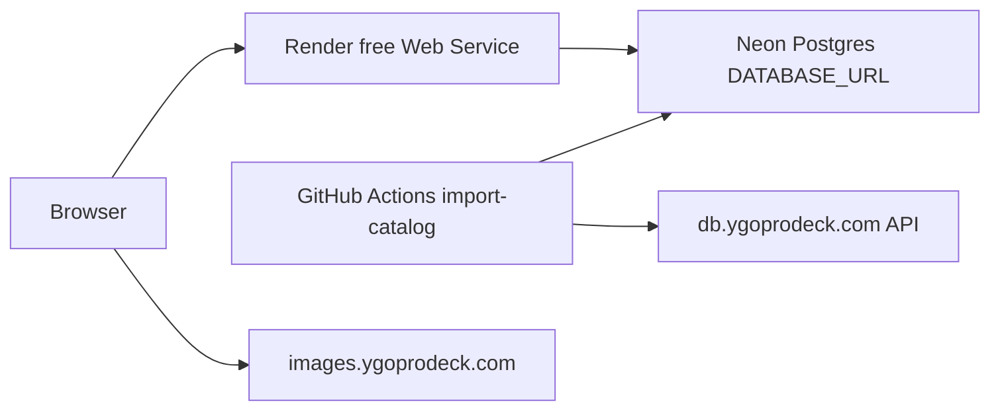

# Agent handoff — YGO Collection & Deck Builder

**Last updated:** 2026-06-01  
**Purpose:** Onboard the next agent/session without re-reading full chat history. Keep this file updated when architecture or deploy steps change.

Also referenced in user rules as `agend_handoff.md` (same content; use this path).

---

## 1. Project summary

| Item | Detail |
|------|--------|
| **What** | Browser UI + FastAPI API for Yu-Gi-Oh! card search, per-user collection (set code + rarity), decks, favorites, tags |
| **Stack** | Python 3.12, FastAPI, SQLAlchemy 2, Pydantic, static HTML/JS, Alembic |
| **Local DB** | SQLite `data/ygo.db` when `DATABASE_URL` unset |
| **Cloud DB** | PostgreSQL (intended: **Neon** free, permanent — not Render Postgres) |
| **Card images** | **CDN only** — `image_url` / `image_url_small` from YGOProDeck; browser loads `images.ygoprodeck.com`. No local JPGs in app. |
| **Auth** | JWT (bcrypt + python-jose); register/login in UI header |

---

## 2. Architecture



### Free permanent cloud (target setup)

| Piece | File / service |
|-------|----------------|
| Web | [`render-free.yaml`](render-free.yaml) — `plan: free`, set `DATABASE_URL` manually in Render env |
| DB | Neon pooled connection string (`?sslmode=require`) |
| Catalog seed | [`.github/workflows/import-catalog.yml`](.github/workflows/import-catalog.yml) |
| DB ping | [`.github/workflows/db-keepalive.yml`](.github/workflows/db-keepalive.yml) (every 3 days) |
| Docs | [`docs/DEPLOY_FREE.md`](docs/DEPLOY_FREE.md) |

### Paid alternative

[`render.yaml`](render.yaml) — Starter web + Render Postgres + paid import job (not $0).

---

## 3. Repository layout (important paths)

```
ygo_app/
  api/main.py, api/routes/     # FastAPI app
  models.py                    # SQLAlchemy models (multi-user)
  database.py                  # ENGINE; Neon SSL via connect_args
  import_data.py               # JSON/API/CSV import
  migration_bootstrap.py       # Alembic stamp when schema predates migrations
  jobs/import_catalog.py       # GHA / Render job entrypoint
  services.py, search_index.py # Search: SQLite FTS5 vs Postgres to_tsvector
  auth.py                      # JWT + bcrypt
  static/                      # UI
alembic/versions/
  001_initial_multiuser.py
  002_widen_rarity_code.py     # REQUIRED for cloud import — see §5
render-free.yaml               # Free web only
render.yaml                    # Paid blueprint
docs/DEPLOY_FREE.md
.github/workflows/
```

---

## 4. What was implemented (recent sessions)

1. **Cloud-ready refactor:** env config ([`ygo_app/config.py`](ygo_app/config.py)), multi-user models, JWT auth, per-user collection/decks/favorites/tags.
2. **Image strategy:** Documented CDN-only; deprecated `ygopro/get_images.py` and `yugipedia/get_images.py`.
3. **Permanent free stack:** Neon + Render free + GitHub Actions (no Render 30-day Postgres).
4. **Import from API:** `--from-api` and `python -m ygo_app.jobs.import_catalog` (no `all_cards.json` required on server).

---

## 5. OPEN ISSUE — GitHub import fails (may still occur)

### Symptom

```
psycopg2.errors.StringDataRightTruncation: value too long for type character varying(16)
```

On `INSERT INTO printings`, during batch commit (~500 cards), when running **Import YGO catalog** workflow.

### Root cause (confirmed with API scan)

- Column `printings.set_rarity_code` was **`VARCHAR(16)`**.
- When YGOProDeck omits `set_rarity_code`, [`_printing_rarity_code()`](ygo_app/import_data.py) builds e.g. `(Quarter Century Secret Rare)` (**29 chars**; max seen **41**).
- **~1115** printings exceed 16 characters.

### Fix already in repo (verify deployed)

| Change | Path |
|--------|------|
| Model `String(64)` for `set_rarity_code` and `collection_items.rarity_code` | [`ygo_app/models.py`](ygo_app/models.py) |
| Alembic migration | [`alembic/versions/002_widen_rarity_code.py`](alembic/versions/002_widen_rarity_code.py) |
| GHA runs migrations before import | [`.github/workflows/import-catalog.yml`](.github/workflows/import-catalog.yml) |

### If error **still** appears

The running workflow is almost certainly on **old code** and/or **old schema**:

1. **Push** latest commits to GitHub (must include migration `002` and workflow `alembic upgrade head` step).
2. Re-run workflow; confirm step **Run database migrations** succeeds.
3. On Neon SQL console, verify column type:
   ```sql
   SELECT character_maximum_length
   FROM information_schema.columns
   WHERE table_name = 'printings' AND column_name = 'set_rarity_code';
   ```
   Expected: **64**. If **16**, run locally:
   ```powershell
   $env:DATABASE_URL="postgresql://...neon pooled url..."
   alembic upgrade head
   ```
4. Re-run **Import YGO catalog**.
5. If tables were created only via `init_db()` / `create_all()` before migration existed, run `alembic upgrade head` (or rely on [`migration_bootstrap.py`](ygo_app/migration_bootstrap.py) stamp on deploy).

---

## 6. Commands cheat sheet

### Local dev

```powershell
cd "c:\Python Projects\YGO App Cursor"
pip install -r requirements.txt
python -m ygo_app.import_data --from-api          # catalog → SQLite
python run.py                                      # http://127.0.0.1:8000
```

### Cloud catalog import (from PC)

```powershell
$env:DATABASE_URL="postgresql://...neon-pooler...?sslmode=require"
$env:ENV="production"
alembic upgrade head
python -m ygo_app.jobs.import_catalog
```

### Production web (Render)

```bash
uvicorn ygo_app.api.main:app --host 0.0.0.0 --port $PORT
```

---

## 7. Environment variables

| Variable | Local | Cloud |
|----------|-------|-------|
| `DATABASE_URL` | unset → SQLite | Neon pooled URL (required) |
| `ENV` | `development` | `production` |
| `SECRET_KEY` | dev default | strong random (Render generated) |
| `PORT` | 8000 | Render `$PORT` |

See [`.env.example`](.env.example).

---

## 8. Data model notes (multi-user)

| Table | Scope |
|-------|--------|
| `cards`, `printings` | Global catalog (import job) |
| `users` | Auth |
| `collection_items`, `decks`, `deck_cards` | `user_id` FK |
| `user_favorites`, `user_card_tags` | Per user (replaced `Card.is_favorite` / global `card_tags`) |

**Rarity matching:** DragonShield `UR` → stored as `(UR)` via [`normalize_rarity_code`](ygo_app/utils.py). Collection joins printings on `(set_code, rarity_code)`.

---

## 9. Deploy order (free stack)

1. Neon project → copy **pooled** `DATABASE_URL`
2. GitHub secret `DATABASE_URL`
3. Push repo with migration `002` + updated workflow
4. Run **Import YGO catalog** (migrations then import)
5. Render **Blueprint `render-free.yaml`** → set same `DATABASE_URL`
6. Register on live URL; CSV import via UI (logged in)

Full steps: [`docs/DEPLOY_FREE.md`](docs/DEPLOY_FREE.md).

---

## 10. Suggested next tasks (priority)

1. **Verify live app:** Render URL, register, CSV import, search.
2. **Commit/push** blueprint fixes (`render.yaml` free default) if not on `main` yet.
3. Optional: Neon storage check after full import (stay under 0.5 GB free).
4. Optional: add note in README linking `agent_handoff.md`.

---

## 11. Do not do without user ask

- Edit `.cursor/plans/*.plan.md` files
- Run `get_images.py` (deprecated; wastes disk)
- Use Render free Postgres (30-day expiry)
- Commit secrets or `DATABASE_URL` to git

---

## 12. Quick verification

| Check | Expected |
|-------|----------|
| `GET /api/health` | `{"ok": true}` |
| `GET /api/status` | `ready: true`, `cards` > 0 after import |
| GitHub import log end | `Catalog import complete: N cards, M printings` |
| Neon column | `printings.set_rarity_code` length **64** |
