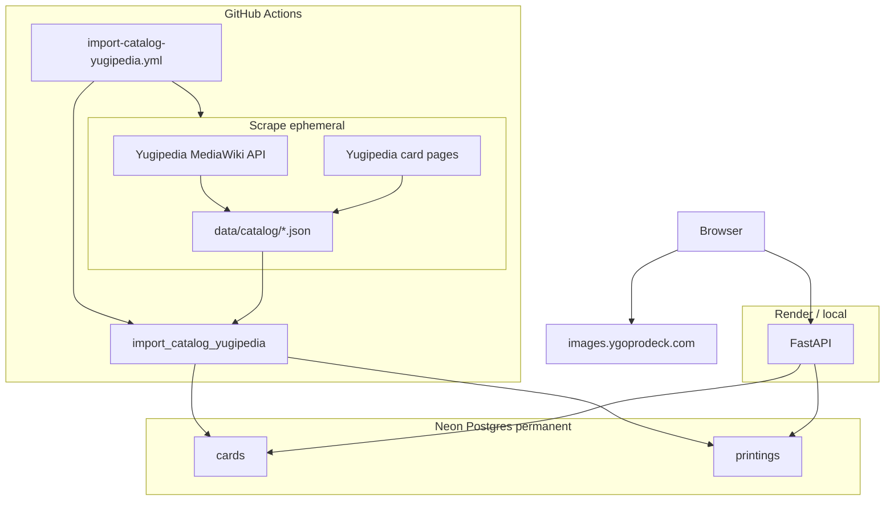

# Agent handoff — YGO Collection & Deck Builder

**Last updated:** 2026-06-03  
**Purpose:** Onboard the next agent/session without re-reading full chat history. Keep this file updated when architecture or deploy steps change.

Also referenced in user rules as `agend_handoff.md` (same content; use this path).

---

## 1. Project summary

| Item | Detail |
|------|--------|
| **What** | Browser UI + FastAPI API for Yu-Gi-Oh! card search, per-user collection (set code + rarity), decks, favorites, tags |
| **Stack** | Python 3.12, FastAPI, SQLAlchemy 2, Pydantic, static HTML/JS, Alembic, `python-dotenv`, BeautifulSoup, cloudscraper |
| **Local DB (fallback)** | SQLite `data/ygo.db` when `DATABASE_URL` unset in `.env` |
| **Recommended local** | Neon **dev** branch via `.env` (`ENV=production`) — see [`docs/LOCAL_DEV.md`](docs/LOCAL_DEV.md) |
| **Cloud DB** | PostgreSQL on **Neon** (pooled URL, `sslmode=require`) — not Render Postgres |
| **Catalog source** | **Yugipedia** scrape (primary) → Neon `cards` / `printings`; fallback: YGOProDeck API job |
| **Card images** | **CDN only** — YGOPRODeck URLs in DB; browser loads `images.ygoprodeck.com` (no image downloads) |
| **Auth** | JWT (`SECRET_KEY` signs tokens; bcrypt for passwords) |

### Environments (three tiers)

| Tier | Git branch | Render service | Neon branch |
|------|------------|----------------|-------------|
| **Local** | any | — (`python run.py`) | **dev** (`.env`) |
| **Staging** | `develop` | `ygo-app-dev` | **dev** |
| **Production** | `main` | `ygo-app` | **main** (production) |

Full workflow: [`docs/ENVIRONMENTS.md`](docs/ENVIRONMENTS.md).

### Status snapshot

| Component | Notes |
|-----------|--------|
| Neon prod | ~**14k+** cards after Yugipedia import (printings count may exceed old YGOPro-only import due to multi-rarity rows) |
| Neon dev | Separate branch; same schema; own users/data — run Yugipedia import on **dev** before prod |
| GitHub | `develop` + `main`; secrets `DATABASE_URL`, `DATABASE_URL_DEV` |
| Render | Dual services in [`render.yaml`](render.yaml); `DATABASE_URL` per service in Dashboard |
| UI search | Paginated (500/page); batch owned/favorite queries on search API |

---

## 2. Architecture



### Catalog pipeline (Yugipedia)

| Phase | Module / job | Output |
|-------|----------------|--------|
| 1. Passcode index | [`ygo_app/yugipedia/passcodes.py`](ygo_app/yugipedia/passcodes.py) | `data/catalog/yugipedia_passcode_list.json` |
| 2. Card details | [`ygo_app/yugipedia/details.py`](ygo_app/yugipedia/details.py) | `data/catalog/yugipedia_all_cards.json`, `yugipedia_rejected_cards.json` |
| 3. Import | [`ygo_app/jobs/import_catalog_yugipedia.py`](ygo_app/jobs/import_catalog_yugipedia.py) + [`adapter.py`](ygo_app/yugipedia/adapter.py) | Neon `cards` + `printings` + search index |

Orchestrator: `python -m ygo_app.jobs.scrape_yugipedia_catalog --full` (or `--passcodes-only` / `--details-only --resume`).

**Where data lives:**

| Location | Contents | Lifetime |
|----------|----------|----------|
| `data/catalog/` | Scrape JSON (gitignored via `data/`) | Local disk or GHA runner only |
| GHA artifacts | Same JSON files | 14 days (debug) |
| Neon | Catalog + user data | Permanent |
| Render | No scrape storage | Reads Neon only |

**Do not** manually delete old `cards`/`printings` in Neon before import — `import_cards_entries` deletes and replaces the full catalog automatically.

**Catalog import side effects** (same as legacy YGOPro import):

- `users` and `collection_items` are **not** cleared.
- `cards` delete cascades to **favorites**, **tags**, and **deck_cards** (those rows can be lost on refresh).
- `collection_items` keep `set_code` + `rarity_code`; `printing_id` may point at removed printings until re-linked / CSV re-import.

### Free permanent cloud

| Piece | File / service |
|-------|----------------|
| Staging web | `ygo-app-dev` — branch **`develop`** |
| Production web | `ygo-app` — branch **`main`** |
| Blueprint | [`render.yaml`](render.yaml), alias [`render-free.yaml`](render-free.yaml) |
| DB | Neon pooled URLs (never Render free Postgres — 30-day expiry) |
| Catalog (primary) | [`.github/workflows/import-catalog-yugipedia.yml`](.github/workflows/import-catalog-yugipedia.yml) — scrape + import, **180 min** timeout, cron **1st & 15th** 03:00 UTC (prod only); manual **production** / **dev**; optional **skip scrape** |
| Catalog (fallback) | [`.github/workflows/import-catalog-ygoprodeck.yml`](.github/workflows/import-catalog-ygoprodeck.yml) — YGOProDeck API only, manual |
| DB ping | [`.github/workflows/db-keepalive.yml`](.github/workflows/db-keepalive.yml) — prod + dev |
| Docs | [`docs/ENVIRONMENTS.md`](docs/ENVIRONMENTS.md), [`docs/LOCAL_DEV.md`](docs/LOCAL_DEV.md), [`docs/DEPLOY_FREE.md`](docs/DEPLOY_FREE.md) |

### Paid alternative

[`render-paid.yaml`](render-paid.yaml) — Starter web + Render Postgres + cron. **Do not** use for the free Neon stack.

---

## 3. Git workflow (layman)

| Action | Effect |
|--------|--------|
| **commit** | Save snapshot locally |
| **push `develop`** | Updates GitHub → deploys **staging** only |
| **merge `develop` → `main`** | Promotes code → deploys **production** |
| **pull** | Download latest from GitHub |

Day-to-day: work on `develop` → push → test staging URL → PR/merge to `main` → smoke-test prod.

`.env` is **gitignored**; never commit secrets. Scrape JSON (`data/catalog/`, `*.json`) is **not** in git.

---

## 4. Repository layout (important paths)

```
ygo_app/
  yugipedia/
    passcodes.py       # MediaWiki API → passcode list
    details.py         # Wiki HTML scrape, checkpoint, --resume
    card_sets.py       # Multi-rarity printing extraction
    parsing.py         # Monster / Spell / Trap page parsers
    adapter.py         # Yugipedia JSON → YGOPro-shaped entries
    images.py          # CDN URL builder (no downloads)
    paths.py           # data/catalog/*.json paths
  jobs/
    scrape_yugipedia_catalog.py   # --full | --passcodes-only | --details-only
    import_catalog_yugipedia.py   # JSON → DB
    import_catalog.py             # YGOProDeck API fallback
  import_data.py       # import_cards_entries (full catalog replace)
  api/, services/, static/js/app.js
data/catalog/          # gitignored scrape outputs
yugipedia/             # thin legacy CLI wrappers → jobs above
tests/
  test_yugipedia_card_sets.py
  test_yugipedia_adapter.py
.github/workflows/
  import-catalog-yugipedia.yml
  import-catalog-ygoprodeck.yml
```

---

## 5. What was implemented (recent sessions)

### Yugipedia catalog (2026-06-03) — current catalog source

1. **Scrape package** under `ygo_app/yugipedia/` (passcodes, details, adapter, CDN images).
2. **Multi-rarity printings:** `extract_rarities_from_cell` uses all `<a>` tags in rarity column (fixes `<br/>` vs `<br>` bug; e.g. RA03-EN172 with Platinum Secret Rare + Quarter Century Secret Rare).
3. **GHA:** bi-monthly scrape + import (~1–2 h); artifacts 14 days; `skip_scrape` for import-only.
4. **Rarity codes:** extended map (e.g. Platinum Secret Rare → `PScR`); unknown → empty code → import uses `(Full Rarity Name)`.
5. **Legacy** `yugipedia/*.py` scripts delegate to `ygo_app.jobs.*`.

### Infrastructure and app (still relevant)

6. Prod-parity local Neon dev, three-tier Render, dual GitHub secrets.  
7. Search pagination + `card_summaries_batch`, Postgres `pool_pre_ping`, CSV `Path` fix.  
8. Alembic `001`/`002`, CDN images, rarity `String(64)`.

---

## 6. Resolved issues (reference)

| Issue | Fix |
|-------|-----|
| One printing per set when multiple rarities | `card_sets.py` — all rarity links per cell |
| Stuck on "Searching…" on Render | Paginated search + batch summaries |
| CSV import 500 | `Path(path)` in `import_collection_csv` |
| `varchar(16)` on import | Migration `002` |
| Idle Neon connections | `pool_pre_ping` |

### If catalog empty

1. Render `DATABASE_URL` must match the Neon branch used for import.  
2. GitHub Actions → **Import Yugipedia catalog** → **dev** or **production**.  
3. `GET /api/status` → `ready: true`, `cards` ~14k+.  
4. Do **not** need to manually truncate Neon catalog tables.

---

## 7. Commands cheat sheet

### Yugipedia catalog (local)

```powershell
cd "c:\Python Projects\YGO App Cursor"
pip install -r requirements.txt
# .env: DATABASE_URL = Neon dev (or omit for SQLite)

# Full scrape (~1–2 h) then import
python -m ygo_app.jobs.scrape_yugipedia_catalog --full
python -m ygo_app.jobs.import_catalog_yugipedia

# Resume interrupted details scrape
python -m ygo_app.jobs.scrape_yugipedia_catalog --details-only --resume
python -m ygo_app.jobs.import_catalog_yugipedia

# Fast fallback (no Yugipedia scrape)
python -m ygo_app.jobs.import_catalog
```

### App

```powershell
alembic upgrade head
python run.py
python -m unittest discover -s tests -v
```

### GitHub Actions

| Workflow | When |
|----------|------|
| **Import Yugipedia catalog** | Primary; prod/dev; optional skip scrape; schedule 1st & 15th → prod |
| **Import YGO catalog (YGOProDeck API fallback)** | Emergency ~minutes |
| **Neon DB keep-alive** | Both secrets |

### Render build (automatic)

`pip install -r requirements.txt && alembic upgrade head`  
`uvicorn ygo_app.api.main:app --host 0.0.0.0 --port $PORT`

---

## 8. Environment variables

| Variable | Local (`.env`) | Render / GHA |
|----------|----------------|--------------|
| `DATABASE_URL` | Neon **dev** pooled URL | **ygo-app-dev:** dev · **ygo-app:** prod |
| `DATABASE_URL_DEV` | — | GHA dev imports only |
| `ENV` | `production` (parity) or unset → SQLite | `production` |
| `SECRET_KEY` | any local string | Render per service |
| `PORT` | `8000` | `$PORT` |

**Search limits** when `ENV=production`: default 200, max 500 (UI `SEARCH_PAGE_SIZE`).

---

## 9. Deploy / setup checklist

| Step | Action |
|------|--------|
| 1 | Neon: **main** + **dev** branches; pooled URLs |
| 2 | GitHub secrets: `DATABASE_URL`, `DATABASE_URL_DEV` |
| 3 | Push code to GitHub (`develop` / `main`) |
| 4 | **Import Yugipedia catalog** on **dev** first (~1–2 h), then **production** |
| 5 | Render: set `DATABASE_URL` on **ygo-app** and **ygo-app-dev** |
| 6 | Verify `GET /api/status`, search, multi-rarity set (e.g. `RA03-EN172`) |
| 7 | No manual Neon delete of old catalog rows required |

---

## 10. Suggested next tasks

1. Run first **Import Yugipedia catalog** on dev after merge; confirm card/printing counts and multi-rarity rows.  
2. Run production import when dev looks good.  
3. Optional: branch protection on `main`; disable prod auto-deploy for manual promote.  
4. After catalog refresh, users may need to re-import collection CSV if `printing_id` links matter.

---

## 11. Do not do without user ask

- Edit `.cursor/plans/*.plan.md` files  
- Run deprecated `yugipedia/get_images.py` or `ygopro/get_images.py` — use [`ygo_app/yugipedia/images.py`](ygo_app/yugipedia/images.py)  
- Manually delete Neon `cards`/`printings` before import (import replaces them)  
- Use Render free Postgres  
- Commit `.env`, secrets, or scrape JSON to git  
- Use `render-paid.yaml` for the free Neon stack  
- Push experimental work directly to `main`

---

## 12. Quick verification

| Check | Expected |
|-------|----------|
| `GET /api/health` | `{"ok": true}` |
| `GET /api/status` | `ready: true`, `cards` ~14k+ |
| Multi-rarity printing | Same `set_code`, different `set_rarity` (e.g. Card Trooper `RA03-EN172`) |
| Search UI | Paginated ~500/page |
| Card images | Load from `images.ygoprodeck.com` |
| `python -m unittest discover -s tests` | All tests pass |
