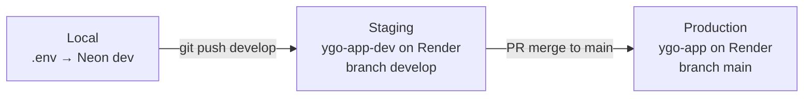

# Environments: local, staging, production

One GitHub repository; three tiers. Code is promoted by **branch**, not by redeploying everything at once.



| Tier | Git branch | App URL | Database |
|------|------------|---------|----------|
| **Local** | any (your machine) | http://127.0.0.1:8000 | Neon **dev** branch ([LOCAL_DEV.md](LOCAL_DEV.md)) |
| **Staging** | `develop` | Render **ygo-app-dev** service URL | Neon **dev** branch |
| **Production** | `main` | Render **ygo-app** service URL | Neon **production** branch |

Pushes to `develop` deploy **staging only**. Merges to `main` deploy **production only**.

---

## One-time setup

### 1. Git branches

```powershell
cd "c:\Python Projects\YGO App Cursor"
git checkout main
git pull
git checkout -b develop
git push -u origin develop
```

Use `develop` for day-to-day work; merge to `main` when staging looks good.

**Optional (GitHub):** Settings → Branches → **Add branch protection rule** for `main`:

- Require a pull request before merging (recommended)
- Do not allow bypassing (optional)

### 2. Neon

- **Production** branch → pooled URL → Render **ygo-app** + secret `DATABASE_URL`
- **Dev** branch → pooled URL → Render **ygo-app-dev** + secret `DATABASE_URL_DEV` + local `.env`

### 3. GitHub Actions secrets

Repository → **Settings** → **Secrets and variables** → **Actions**:

| Secret | Value |
|--------|--------|
| `DATABASE_URL` | Neon **production** pooled URL |
| `DATABASE_URL_DEV` | Neon **dev** pooled URL |

### 4. Render (Blueprint or Dashboard)

[`render.yaml`](../render.yaml) defines two services:

| Service | Branch | Set in Dashboard |
|---------|--------|------------------|
| `ygo-app-dev` | `develop` | `DATABASE_URL` = Neon **dev** pooled URL |
| `ygo-app` | `main` | `DATABASE_URL` = Neon **production** pooled URL |

After updating the blueprint or creating **ygo-app-dev**:

1. Open each service → **Environment** → set `DATABASE_URL` (different per service).
2. Confirm **Branch** matches (`develop` / `main`).
3. Deploy both once.

If you already had a single `ygo-app` service, set its branch to **main** and add **ygo-app-dev** for staging.

### 5. Catalog on each database

**Production** (monthly schedule or manual):

- Actions → **Import Yugipedia catalog** → environment **production**

**Dev** (after new branch or reset):

- Actions → **Import Yugipedia catalog** → environment **dev**

Or locally with dev URL in `.env`:

```powershell
alembic upgrade head
python -m ygo_app.jobs.import_catalog
```

---

## Day-to-day workflow

1. Code locally (`.env` → Neon dev) — `python run.py` or `--reload`
2. Commit on `feature/...` → merge into **`develop`**
3. Push **`develop`** → staging URL updates automatically
4. Test staging: search, pagination, login, CSV import
5. Open PR **`develop` → `main`**, review, merge
6. Production redeploys from **`main`** (auto-deploy on Render by default)
7. Smoke-test production `/api/status` and critical flows

**Optional:** On Render **ygo-app** (prod), disable **Auto-Deploy** and use **Manual Deploy** after merging to `main` for an extra gate.

---

## GitHub Actions

| Workflow | Purpose |
|----------|---------|
| **Import Yugipedia catalog** | Chained jobs: passcodes + 6 detail batches + import (~2–4 h). Each batch must log `[BATCH_RESULT] missing=0` or job exits **3**. Manual: **production** or **dev**. Schedule: **1st & 15th**, production only. Fallback: Import YGO catalog (YGOProDeck API). |
| **Neon DB keep-alive** | Pings both DBs (needs both secrets). |

---

## Promotion checklist

Before merging `develop` → `main`:

- [ ] Staging `/api/status` shows `ready: true`, cards ~14k
- [ ] Search and pagination work on staging
- [ ] CSV import works (logged in on staging)
- [ ] No uncommitted secrets in git
- [ ] Alembic migrations included if schema changed (deploy runs `alembic upgrade head`)

After merge to `main`:

- [ ] Production deploy succeeded on Render
- [ ] Production `/api/status` OK
- [ ] Quick UI smoke test on production URL

---

## What not to do

- Use the same `DATABASE_URL` on staging and production
- Push experimental commits directly to `main`
- Commit `.env` to git

See also: [LOCAL_DEV.md](LOCAL_DEV.md), [DEPLOY_FREE.md](DEPLOY_FREE.md).
