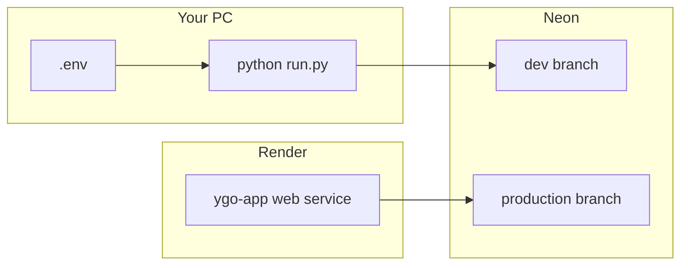

# Local development (production parity)

Run the same app configuration as [Render](https://render.com) locally: `ENV=production`, Neon Postgres, production search limits, and static asset caching. Use a **separate Neon branch** so dev work does not touch live production data.

## Architecture



| | Production (Render) | Local prod-parity |
|--|---------------------|-------------------|
| Database | Neon production branch | Neon **dev** branch |
| `ENV` | `production` | `production` (in `.env`) |
| Search page size | 500 max | 500 max |
| Users / JWT | Production accounts | Separate dev accounts |

## One-time setup

### 1. Neon dev branch

1. Open [Neon Console](https://console.neon.tech) → your project.
2. **Branches** → **Create branch** (e.g. name `dev`) from your main/production branch.
3. Open the new branch → **Connection details** → copy the **pooled** URL (`-pooler` in host, `sslmode=require`).

### 2. Project `.env`

```powershell
cd "c:\Python Projects\YGO App Cursor"
pip install -r requirements.txt
copy .env.example .env
```

Edit `.env` (never commit it):

```env
ENV=production
DATABASE_URL=postgresql://...@ep-xxx-dev-pooler.../neondb?sslmode=require
SECRET_KEY=any-long-random-string-for-local-only
PORT=8000
```

### 3. Schema and catalog

```powershell
alembic upgrade head
python -m ygo_app.jobs.import_catalog
```

This may take several minutes (full YGOProDeck catalog, ~14k cards).

### 4. Run the app

```powershell
python run.py
```

Optional hot reload while editing code:

```powershell
python run.py --reload
```

Open http://127.0.0.1:8000 — register a **new account** (dev DB has no production users).

## Verification

| Check | Expected |
|-------|----------|
| `GET http://127.0.0.1:8000/api/status` | `ready: true`, `cards` ~14371 |
| Search tab | Pagination ~29 pages (500 per page) |
| My Collection → Import CSV | Header status line shows progress + ETA; success alert with row count |
| `alembic current` | Shows `head` |

## Daily workflow

1. `python run.py` (or `--reload` when changing Python/static files).
2. Hard refresh (Ctrl+Shift+R) after static JS/CSS changes in production mode (browser may cache assets).
3. Deploy to Render only when you want to ship changes to the live site.

## Refresh dev data from production

In Neon, you can reset the `dev` branch from production or re-run:

```powershell
alembic upgrade head
python -m ygo_app.jobs.import_catalog
```

## Yugipedia catalog test mode (~500 cards)

Every Yugipedia import **fully replaces** `cards` and `printings` in the target database (not a merge). A test run leaves only the scraped subset until you run a full import again. Use **Neon dev** only.

**Local CLI** (`.env` → dev `DATABASE_URL`):

```powershell
python -m ygo_app.jobs.scrape_yugipedia_catalog --passcodes-only --max-cards 500
python -m ygo_app.jobs.scrape_yugipedia_catalog --details-only --resume --batch-index 0 --batch-count 1
python -m ygo_app.jobs.import_catalog_yugipedia --limit 500
```

`--limit 500` uses a minimum of 400 mapped cards (`80%`); override with `--min-cards` if needed.

After scrape, each entry in `data/catalog/yugipedia_all_cards.json` should include `image_url` and `image_url_small` pointing at `ms.yugipedia.com` (extracted from the wiki page HTML, not downloaded).

### TCG-only catalog (English printings)

The Yugipedia pipeline keeps only cards with at least one English timeline printing (`cts--EN` on the wiki → `card_sets` in JSON). OCG-only cards (e.g. no TCG release) are **rejected** during detail scrape (`yugipedia_rejected_cards.json`) and skipped on import. The passcode list still includes them until scrape runs.

To remove OCG-only cards already in your dev DB from an older scrape:

```powershell
python -m ygo_app.jobs.scrape_yugipedia_catalog --full
python -m ygo_app.jobs.import_catalog_yugipedia
```

Re-import alone is enough if `yugipedia_all_cards.json` no longer contains entries without `card_sets`.

**GitHub Actions:** **Import Yugipedia catalog** → **Run workflow** (not Re-run failed jobs) → branch `develop` → environment `dev` → `test_mode` **true** → `card_limit` **500**. `test_mode` on production is blocked in the workflow.

## Lightweight SQLite mode (not production-like)

For quick offline experiments only:

- Remove or comment out `DATABASE_URL` in `.env`.
- Set `ENV=development`.
- Run `python -m ygo_app.import_data --from-api` once (uses `data/ygo.db`, fewer cards if you use `--limit`).

This does **not** match Render behavior (different DB engine, search limits, and scale).

## Troubleshooting

| Symptom | Fix |
|---------|-----|
| `Database not found` on start | You are in SQLite mode — either create DB with `import_data` or set `DATABASE_URL` in `.env`. |
| Catalog empty (`ready: false`) | Run `python -m ygo_app.jobs.import_catalog` against your dev branch URL. |
| SSL / connection errors | Use Neon **pooled** URL with `sslmode=require`. |
| 401 on collection/decks | Log in on the dev site (separate from Render login). |
| Port in use | `python run.py --port 8001 --no-browser` |

See also [ENVIRONMENTS.md](ENVIRONMENTS.md) (staging + production promotion), [DEPLOY_FREE.md](DEPLOY_FREE.md) for Render and GitHub Actions setup.

## Cardmarket prices (local scrape)

Cardmarket returns HTTP 403/429 from cloud IPs and aggressive scraping. Scrape on your machine, then import to Neon.

**Prerequisite:** `data/catalog/yugipedia_all_cards.json` (from Yugipedia scrape or GHA catalog artifact).

**Playwright (recommended if you hit HTTP 429):** one-time browser install after `pip install -r requirements.txt`:

```powershell
python -m playwright install chromium
```

```powershell
# Scrape locally → JSON (no DATABASE_URL required)
python -m ygo_app.jobs.scrape_cardmarket_prices --browser --limit 500 --workers 1
python -m ygo_app.jobs.scrape_cardmarket_prices --browser --workers 1   # incremental

# cloudscraper (faster when not rate-limited)
python -m ygo_app.jobs.scrape_cardmarket_prices --limit 500
python -m ygo_app.jobs.scrape_cardmarket_prices

# Option A — promote via R2 + GitHub Actions
python -m ygo_app.jobs.upload_cardmarket_prices
# Actions → "Import Cardmarket prices" → environment dev or production

# Option B — import directly to Neon dev (.env DATABASE_URL)
python -m ygo_app.jobs.import_cardmarket_prices -f data/catalog/cardmarket_prices.json
```

If you are already rate-limited (HTTP 429), wait several hours before retrying. Use `--prices-only` when discovery is already in `cardmarket_cache.db`. Avoid `--full` until expansion codes are seeded.

| File | Role |
|------|------|
| `data/catalog/cardmarket_prices.json` | Export snapshot (upload to R2) |
| `data/catalog/cardmarket_cache.db` | Local incremental scrape state |
| `ygo_app/cardmarket/expansion_seed.json` | Bundled expansion_id → code map (reduces probe HTTP) |
| R2 `catalog/cardmarket_prices.json` | Private handoff for GHA import |

Requires `S3_*` in `.env` for upload (same as image mirror). GHA import uses repo secrets.
