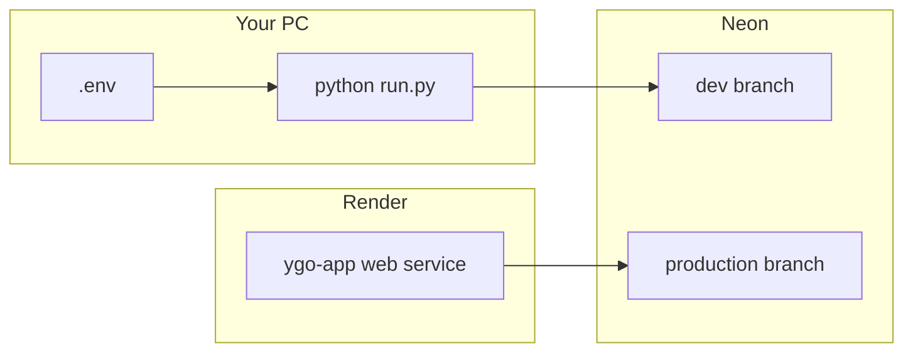

# Local development (production parity)

Run the same app configuration as [Render](https://render.com) locally: `ENV=production`, Neon Postgres, production search limits, and static asset caching. Use a **separate Neon branch** so dev work does not touch live production data.

## Architecture



| | Production (Render) | Local prod-parity |
|--|---------------------|-------------------|
| Database | Neon production branch | Neon **dev** branch |
| `ENV` | `production` | `production` (in `.env`) |
| Search page size | 500 max | 500 max |
| Users / JWT | Production accounts | Separate dev accounts |

## One-time setup

### 1. Neon dev branch

1. Open [Neon Console](https://console.neon.tech) → your project.
2. **Branches** → **Create branch** (e.g. name `dev`) from your main/production branch.
3. Open the new branch → **Connection details** → copy the **pooled** URL (`-pooler` in host, `sslmode=require`).

### 2. Project `.env`

```powershell
cd "c:\Python Projects\YGO App Cursor"
pip install -r requirements.txt
copy .env.example .env
```

Edit `.env` (never commit it):

```env
ENV=production
DATABASE_URL=postgresql://...@ep-xxx-dev-pooler.../neondb?sslmode=require
SECRET_KEY=any-long-random-string-for-local-only
PORT=8000
```

### 3. Schema and catalog

```powershell
alembic upgrade head
python -m ygo_app.jobs.import_catalog
```

This may take several minutes (full YGOProDeck catalog, ~14k cards).

### 4. Run the app

```powershell
python run.py
```

Optional hot reload while editing code:

```powershell
python run.py --reload
```

Open http://127.0.0.1:8000 — register a **new account** (dev DB has no production users).

## Verification

| Check | Expected |
|-------|----------|
| `GET http://127.0.0.1:8000/api/status` | `ready: true`, `cards` ~14371 |
| Search tab | Pagination ~29 pages (500 per page) |
| My Collection → Import CSV | Header status line shows progress + ETA; success alert with row count |
| `alembic current` | Shows `head` |

## Daily workflow

1. `python run.py` (or `--reload` when changing Python/static files).
2. Hard refresh (Ctrl+Shift+R) after static JS/CSS changes in production mode (browser may cache assets).
3. Deploy to Render only when you want to ship changes to the live site.

## Refresh dev data from production

In Neon, you can reset the `dev` branch from production or re-run:

```powershell
alembic upgrade head
python -m ygo_app.jobs.import_catalog
```

## Yugipedia catalog test mode (~500 cards)

Every Yugipedia import **fully replaces** `cards` and `printings` in the target database (not a merge). A test run leaves only the scraped subset until you run a full import again. Use **Neon dev** only.

**Local CLI** (`.env` → dev `DATABASE_URL`):

```powershell
python -m ygo_app.jobs.scrape_yugipedia_catalog --passcodes-only --max-cards 500
python -m ygo_app.jobs.scrape_yugipedia_catalog --details-only --resume --batch-index 0 --batch-count 1
python -m ygo_app.jobs.import_catalog_yugipedia --limit 500
```

`--limit 500` uses a minimum of 400 mapped cards (`80%`); override with `--min-cards` if needed.

After scrape, each entry in `data/catalog/yugipedia_all_cards.json` should include `image_url` and `image_url_small` pointing at `ms.yugipedia.com` (extracted from the wiki page HTML, not downloaded).

### TCG-only catalog (English printings)

The Yugipedia pipeline keeps only cards with at least one English timeline printing (`cts--EN` on the wiki → `card_sets` in JSON). OCG-only cards (e.g. no TCG release) are **rejected** during detail scrape (`yugipedia_rejected_cards.json`) and skipped on import. The passcode list still includes them until scrape runs.

To remove OCG-only cards already in your dev DB from an older scrape:

```powershell
python -m ygo_app.jobs.scrape_yugipedia_catalog --full
python -m ygo_app.jobs.import_catalog_yugipedia
```

Re-import alone is enough if `yugipedia_all_cards.json` no longer contains entries without `card_sets`.

**GitHub Actions:** **Import Yugipedia catalog** → **Run workflow** (not Re-run failed jobs) → branch `develop` → environment `dev` → `test_mode` **true** → `card_limit` **500**. `test_mode` on production is blocked in the workflow.

## Lightweight SQLite mode (not production-like)

For quick offline experiments only:

- Remove or comment out `DATABASE_URL` in `.env`.
- Set `ENV=development`.
- Run `python -m ygo_app.import_data --from-api` once (uses `data/ygo.db`, fewer cards if you use `--limit`).

This does **not** match Render behavior (different DB engine, search limits, and scale).

## Troubleshooting

| Symptom | Fix |
|---------|-----|
| `Database not found` on start | You are in SQLite mode — either create DB with `import_data` or set `DATABASE_URL` in `.env`. |
| Catalog empty (`ready: false`) | Run `python -m ygo_app.jobs.import_catalog` against your dev branch URL. |
| SSL / connection errors | Use Neon **pooled** URL with `sslmode=require`. |
| 401 on collection/decks | Log in on the dev site (separate from Render login). |
| Port in use | `python run.py --port 8001 --no-browser` |

See also [ENVIRONMENTS.md](ENVIRONMENTS.md) (staging + production promotion), [DEPLOY_FREE.md](DEPLOY_FREE.md) for Render and GitHub Actions setup.

## Cardmarket prices (local scrape)

Cardmarket returns HTTP 403/429 and Cloudflare **Error 1015** from aggressive scraping. See **[docs/cloudflare/README.md](cloudflare/README.md)** for rate-limit theory and **[docs/cloudflare/cardmarket-scraper-behavior.md](cloudflare/cardmarket-scraper-behavior.md)** for how the browser scraper actually behaves (console output, pagination, profile pool).

Scrape on your machine in **four steps**, then import to Neon.

**Prerequisites:**
- `data/catalog/yugipedia_all_cards.json` (for step 4 export only)
- Optional one-time Cloudflare cookies via `--cf-login` on job 1

**Recommended (polite browser mode):** after `pip install -r requirements.txt`:

```powershell
python -m playwright install chromium
```

```powershell
# Step 1 — expansion list (one-time CF login when needed)
python -m ygo_app.jobs.scrape_cardmarket_expansions --cf-login
python -m ygo_app.jobs.scrape_cardmarket_expansions --polite

# Step 2 — all TCG card list rows (resumable)
python -m ygo_app.jobs.scrape_cardmarket_card_list --browser --headed --polite --resume
python -m ygo_app.jobs.scrape_cardmarket_card_list --polite --resume --limit 5   # dev test

# Step 3 — detail pages / prices (resumable)
python -m ygo_app.jobs.scrape_cardmarket_card_details --polite --resume
python -m ygo_app.jobs.scrape_cardmarket_card_details --browser --headed --polite --resume

# Step 4 — join with Yugipedia catalog → cardmarket_prices.json
python -m ygo_app.jobs.export_cardmarket_prices

# Promote via R2 + GHA, or import directly to Neon dev
python -m ygo_app.jobs.upload_cardmarket_prices
python -m ygo_app.jobs.import_cardmarket_prices -f data/catalog/cardmarket_prices.json
```

**`--polite`** sets browser backend, 1 worker, and conservative RPS (~0.12 discovery / ~0.2 price). Browser mode adds a **2–8 s** randomized delay after each successful page fetch. Checkpoints save every **5** expansions (job 2) or **5** cards (job 3). Override with `--rps` / `--discovery-rps` or `.env` (`CARDMARKET_DISCOVERY_RPS`, `CARDMARKET_PRICE_RPS`, `CARDMARKET_WORKERS`).

### Console output and request budget

Each expansion may require **multiple page fetches** (`site=1`, `site=2`, …). The job prints **one line per expansion** when done, but **`[FETCH] OK` once per page**. A run of 3 expansions can easily be 9+ navigations.

| Log prefix | Meaning |
|------------|---------|
| `[FETCH] OK` | One successful page navigation (shows `idExpansion`, `site`, `mode`, …) |
| `[CARD_LIST] expansion … success, N cards` | Expansion complete (all pages) |
| `[WARN] browser fetch failed` | Failed fetch; same compact URL label as `[FETCH] OK` |

Full guide: **[docs/cloudflare/cardmarket-scraper-behavior.md](cloudflare/cardmarket-scraper-behavior.md)**.

### After HTTP 429 or Error 1015 (IP ban)

The scraper **saves a checkpoint and exits** when `Retry-After >= 600` seconds (instead of sleeping for an hour).

1. Wait until the ban expires (often 1 hour; check https://www.cardmarket.com in your **normal browser**, not scrape Chrome).
2. Reset burned profiles if needed: delete or edit `data/catalog/cardmarket_profile_state.json`.
3. Resume slower (or use a different egress IP once cardmarket.com loads in your normal browser):

```powershell
python -m ygo_app.jobs.scrape_cardmarket_card_list --browser --headed --polite --resume --discovery-rps 0.05
```

### Changing IP

Cloudflare counters are usually keyed by **source IP**. If your home connection stays banned, waiting often takes ~1 hour. A **different egress IP** (e.g. mobile hotspot) is a verified way to scrape again once Cloudflare allows that address — still use `--polite` and low `--discovery-rps`.

### Chrome profile pool (optional)

`--browser-profiles` uses isolated Chrome user-data dirs under `data/catalog/cardmarket_profiles/`. This is for **cookie/session isolation**, not IP-ban bypass. The scraper **no longer rotates profiles on warmup HTTP 429** (that amplified bans by launching multiple Chromes on the same IP). State: `data/catalog/cardmarket_profile_state.json`.

### Why profile rotation did not help (IP bans)

Cloudflare rate limits often count by **source IP**, not browser profile. Rotating `--browser-profiles` on the same connection does not reset an IP-level ban. Profiles only help when a specific cookie/session is flagged, not when your IP is blocked. See [cardmarket-scraper-behavior.md](cloudflare/cardmarket-scraper-behavior.md).

Job 3 `--fast` (20 workers / 8 rps) requires `--i-accept-rate-limit-risk` and is not recommended.

| File | Role |
|------|------|
| `data/catalog/cardmarket_expansion_list.json` | Job 1 output |
| `data/catalog/cardmarket_card_list.json` | Job 2 output |
| `data/catalog/cardmarket_card_details.json` | Job 3 output |
| `data/catalog/cardmarket_prices.json` | Job 4 export (upload to R2) |
| `data/catalog/cardmarket_*_checkpoint.json` | Resume state for jobs 2–3 |
| `data/catalog/cardmarket_profile_state.json` | Active/burned browser profiles (cookie/session pool) |
| `data/catalog/cardmarket_profiles/{name}/` | Per-profile Chrome user-data + `browser_state.json` |
| `ygo_app/cardmarket/expansion_seed.json` | Auto-regenerated after job 2 |
| R2 `catalog/cardmarket_prices.json` | Private handoff for GHA import |

Requires `S3_*` in `.env` for upload (same as image mirror). GHA import uses repo secrets.
