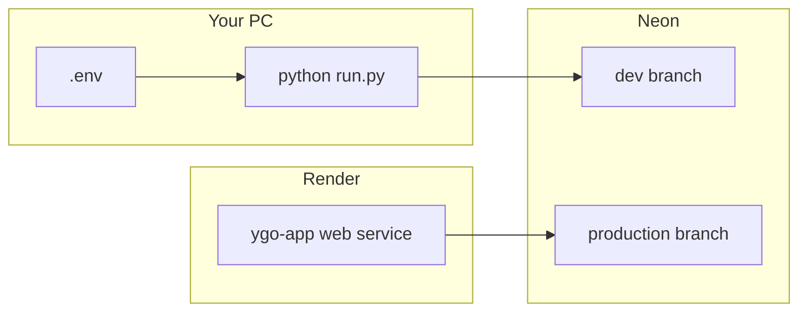

# Local development (production parity)

Run the same app configuration as [Render](https://render.com) locally: `ENV=production`, Neon Postgres, production search limits, and static asset caching. Use a **separate Neon branch** so dev work does not touch live production data.

## Architecture



| | Production (Render) | Local prod-parity |
|--|---------------------|-------------------|
| Database | Neon production branch | Neon **dev** branch |
| `ENV` | `production` | `production` (in `.env`) |
| Search page size | 500 max | 500 max |
| Users / JWT | Production accounts | Separate dev accounts |

## One-time setup

### 1. Neon dev branch

1. Open [Neon Console](https://console.neon.tech) → your project.
2. **Branches** → **Create branch** (e.g. name `dev`) from your main/production branch.
3. Open the new branch → **Connection details** → copy the **pooled** URL (`-pooler` in host, `sslmode=require`).

### 2. Project `.env`

```powershell
cd "c:\Python Projects\YGO App Cursor"
pip install -r requirements.txt
copy .env.example .env
```

Edit `.env` (never commit it):

```env
ENV=production
DATABASE_URL=postgresql://...@ep-xxx-dev-pooler.../neondb?sslmode=require
SECRET_KEY=any-long-random-string-for-local-only
PORT=8000
```

### 3. Schema and catalog

```powershell
alembic upgrade head
python -m ygo_app.jobs.import_catalog
```

This may take several minutes (full YGOProDeck catalog, ~14k cards).

### 4. Run the app

```powershell
python run.py
```

Optional hot reload while editing code:

```powershell
python run.py --reload
```

Open http://127.0.0.1:8000 — register a **new account** (dev DB has no production users).

## Verification

| Check | Expected |
|-------|----------|
| `GET http://127.0.0.1:8000/api/status` | `ready: true`, `cards` ~14371 |
| Search tab | Pagination ~29 pages (500 per page) |
| My Collection → Import CSV | Success alert with row count |
| `alembic current` | Shows `head` |

## Daily workflow

1. `python run.py` (or `--reload` when changing Python/static files).
2. Hard refresh (Ctrl+Shift+R) after static JS/CSS changes in production mode (browser may cache assets).
3. Deploy to Render only when you want to ship changes to the live site.

## Refresh dev data from production

In Neon, you can reset the `dev` branch from production or re-run:

```powershell
alembic upgrade head
python -m ygo_app.jobs.import_catalog
```

## Lightweight SQLite mode (not production-like)

For quick offline experiments only:

- Remove or comment out `DATABASE_URL` in `.env`.
- Set `ENV=development`.
- Run `python -m ygo_app.import_data --from-api` once (uses `data/ygo.db`, fewer cards if you use `--limit`).

This does **not** match Render behavior (different DB engine, search limits, and scale).

## Troubleshooting

| Symptom | Fix |
|---------|-----|
| `Database not found` on start | You are in SQLite mode — either create DB with `import_data` or set `DATABASE_URL` in `.env`. |
| Catalog empty (`ready: false`) | Run `python -m ygo_app.jobs.import_catalog` against your dev branch URL. |
| SSL / connection errors | Use Neon **pooled** URL with `sslmode=require`. |
| 401 on collection/decks | Log in on the dev site (separate from Render login). |
| Port in use | `python run.py --port 8001 --no-browser` |

See also [ENVIRONMENTS.md](ENVIRONMENTS.md) (staging + production promotion), [DEPLOY_FREE.md](DEPLOY_FREE.md) for Render and GitHub Actions setup.
