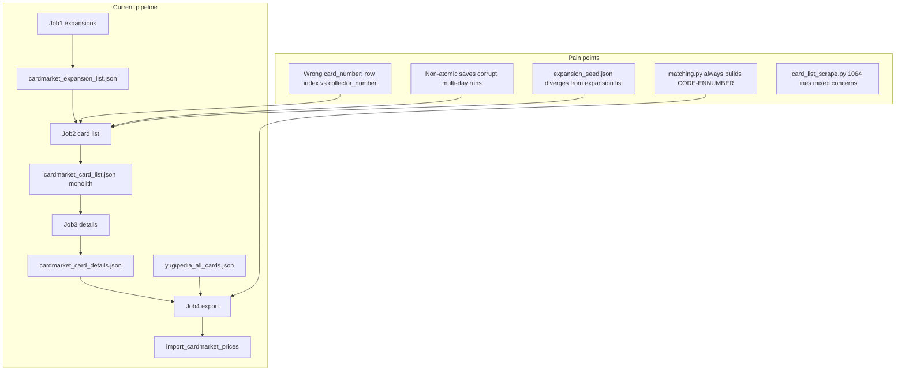
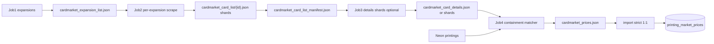
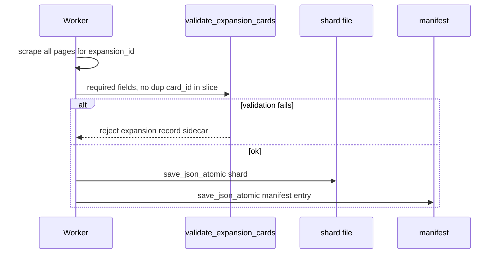

# Cardmarket Scraper Refactoring Plan

> **Status:** Implemented (v2)  
> **Created:** 2026-06-25  
> **Updated:** 2026-06-26  
> **Source notes:** [`DO NOT DELETE/refactor_cardmarket_scraper`](../DO%20NOT%20DELETE/refactor_cardmarket_scraper)

## Implementation checklist

- [ ] Fix `product_list` parser to use `data-testid="collector_number"`; add HTML fixtures + unit tests (YS15/D18, LOB/050, LOB-25TH/062)
- [ ] Add `save_json_atomic`, `cardmarket_card_list/{id}.json` shards, manifest.json, per-expansion transaction flow in job 2
- [ ] Add `load_card_list_cards()` merge helper; update `catalog_consistency`, `cardmarket_catalog_status`, `repair_cardmarket_catalog` for shard layout
- [ ] Apply atomic shard + manifest pattern to `card_details_scrape`; remove synthetic `card_set_number` field
- [ ] Remove `expansion_seed` regeneration and `seed_codes` from incremental diff; use `expansion_list.json` as sole code source
- [ ] Implement `containment_matching.py` and rewrite `details_export.py` with 0/1/>1 match resolution rules
- [ ] Add `card_list_validate.py` and per-stage validation; wire into scrape commits
- [ ] Enforce Yugipedia→Cardmarket 1:1 on import; fail on ambiguous matches
- [x] Set `--polite` discovery RPS to 0.05; update `agent_handoff.md`, `LOCAL_DEV.md`, cloudflare docs

---

Based on the source notes and the current implementation under [`ygo_app/cardmarket/`](../ygo_app/cardmarket/).

## Current state (problems)



| Issue | Root cause in code |
|-------|-------------------|
| `card_number: "2"` instead of `"D18"` | [`product_list._extract_card_number`](../ygo_app/cardmarket/product_list.py) uses pipe-split heuristics / hidden column index; never reads `data-testid="collector_number"` |
| Dataset corruption on interrupt | [`artifact_io.save_json`](../ygo_app/cardmarket/artifact_io.py) overwrites in place; job 2 batches 5 expansions then rewrites entire monolith |
| `expansion_seed.json` maintenance | Auto-regenerated in [`card_list_scrape`](../ygo_app/cardmarket/card_list_scrape.py); used as fallback in [`incremental.diff_expansions`](../ygo_app/cardmarket/incremental.py) and [`expansions.apply_seed_to_cache`](../ygo_app/cardmarket/expansions.py) |
| Yugipedia join failures (LOB-E050, LOB-25TH) | [`matching.cardmarket_match_key`](../ygo_app/cardmarket/matching.py) hardcodes `{code}-EN{number}`; same in [`card_details_scrape`](../ygo_app/cardmarket/card_details_scrape.py) line 170 |
| Ambiguous DB data | Export allows unmatched; import has no 1:1 Yugipedia→Cardmarket gate |

**Prerequisite:** Treat existing `cardmarket_card_list.json` / details as invalid; plan for a **full re-scrape** after parser + storage land.

---

## Target architecture



### Design principles

1. **One expansion = one transaction** — scrape → validate → write shard → update manifest (never partial shard).
2. **Resume from manifest** — next expansion = first `expansion_id` in job-1 list not in manifest `completed`.
3. **No expansion_seed** — `expansion_code` comes only from job-1 list + per-row HTML in job-2.
4. **Raw Cardmarket values in scrape artifacts** — store `expansion_code` + `card_number` exactly as on Cardmarket; matching logic lives only in job-4.
5. **Browser-only production path** — keep `--polite` preset; tune discovery RPS to **0.05** (verified stable for card-list scraping in [`constants.py`](../ygo_app/cardmarket/constants.py)).

---

## Phase 1 — Parser fix + HTML fixtures

**Goal:** Correct `card_number` from `data-testid="collector_number"`.

### Changes

- Rewrite [`product_list._extract_card_number`](../ygo_app/cardmarket/product_list.py):
  - Primary: `row.find(attrs={"data-testid": "collector_number"})` → last non-`#` span text (`D18`, `050`, `062`).
  - Fallback: existing column heuristic only when testid missing (legacy HTML).
- Add `data-testid` selectors for `name`, `rarity`, `expansion` while touching the row parser (reduces brittle pipe-splitting).
- Remove dead duplicate path: delete unused `scrape_expansion_products()` from `product_list.py`.

### Tests (static HTML only — no live Cardmarket)

Add fixtures under `cardmarket/debug_samples/` from user-provided HTML:

| Case | Expected `card_number` |
|------|------------------------|
| YS15 / Dust Tornado | `D18` |
| LOB / Mystical Elf V.1 | `050` |
| LOB-25TH / Mystical Elf | `062` |

Update [`tests/test_cardmarket_card_list_scrape.py`](../tests/test_cardmarket_card_list_scrape.py) to assert collector numbers explicitly.

**Before implementation:** Save list-view HTML snippets for the three examples in the refactor doc to `cardmarket/debug_samples/`.

---

## Phase 2 — Sharded atomic persistence + per-expansion transactions

**Goal:** Interrupt-safe job-2; no more monolithic corruption.

### New artifacts ([`paths.py`](../ygo_app/cardmarket/paths.py))

| Path | Purpose |
|------|---------|
| `data/catalog/cardmarket_card_list/` | One JSON array per expansion: `{expansion_id}.json` |
| `data/catalog/cardmarket_card_list_manifest.json` | Progress + outcomes per expansion |
| `data/catalog/cardmarket_empty_expansions.json` | Unchanged sidecar |
| `data/catalog/cardmarket_rejected_expansions.json` | Unchanged sidecar |

### Manifest schema (example)

```json
{
  "version": 1,
  "updated_at": "2026-06-25T12:00:00Z",
  "completed": {
    "1651": {"status": "has_cards", "card_count": 42, "shard": "1651.json"},
    "9999": {"status": "empty"},
    "8888": {"status": "rejected", "reason": "no_product_rows"}
  },
  "last_expansion_id": 1651
}
```

### Atomic write helper

Extend [`artifact_io.py`](../ygo_app/cardmarket/artifact_io.py):

```python
def save_json_atomic(path: Path, data: Any) -> None:
    tmp = path.with_suffix(path.suffix + ".tmp")
    tmp.write_text(...)
    tmp.replace(path)  # os.replace on Windows
```

### Per-expansion transaction flow (job 2)



- **Checkpoint every expansion** (not every 5) — manifest is the checkpoint.
- Keep existing behaviors: `prompt_no_product_rows`, phase-2 serial recovery, rejected/empty sidecars, logging via `run_job_logged`, timestamps in manifest.
- [`catalog_consistency.audit_card_list_coverage`](../ygo_app/cardmarket/catalog_consistency.py): load cards by iterating manifest + shards instead of one list file.

### Compatibility shim

- Add `load_card_list_cards()` helper that merges shards (sorted by `expansion_id`) for job-3 and status tools.
- Optional `--merge-shards` command or automatic merge to legacy `cardmarket_card_list.json` for debugging only (not written during scrape).

### Job 3 shards (optional follow-up in same phase)

Mirror pattern: `cardmarket_card_details/{card_id}.json` + manifest, or keep monolith with **per-card atomic append** if shard count (~100k+) is a concern. Recommend **per-expansion detail shards** keyed by `expansion_id` to align with job-2 granularity and reduce open files.

---

## Phase 3 — Remove `expansion_seed.json` middleman

**Goal:** Single source of truth = `cardmarket_expansion_list.json`.

### Changes

- Stop calling [`regenerate_expansion_seed`](../ygo_app/cardmarket/expansion_seed.py) from [`card_list_scrape`](../ygo_app/cardmarket/card_list_scrape.py).
- Refactor [`incremental.diff_expansions`](../ygo_app/cardmarket/incremental.py): drop `seed_codes` parameter; match migrations using `expansion_code` on stored + live rows only; if code missing, treat as `never_scraped` / force re-scrape.
- [`expansions.apply_seed_to_cache`](../ygo_app/cardmarket/expansions.py): populate DB cache from scraped expansion list JSON instead of bundled seed.
- Deprecate bundled [`expansion_seed.json`](../ygo_app/cardmarket/expansion_seed.json) (keep file one release with deprecation log, then remove).
- Update [`tests/test_cardmarket_discover.py`](../tests/test_cardmarket_discover.py) to use expansion list fixtures.

---

## Phase 4 — Containment-based Yugipedia ↔ Cardmarket matching

**Goal:** Match Cardmarket raw codes to Yugipedia regional set codes without inventing `-EN`.

### New module: `ygo_app/cardmarket/containment_matching.py`

**Parse Yugipedia `set_code`** into components:

- `LOB-EN062` → base `LOB`, suffix `062`
- `LOB-E050` → base `LOB`, suffix `050` (strip region letter when comparing digits)
- `LOB-062` → base `LOB`, suffix `062`
- `YS15-END18` → base `YS15`, suffix `D18` (strip `EN` region marker before digit compare)

**Match rule** (from refactor doc):

```
match(cm, yg) :=
  normalize_base(yg.base) in normalize_base(cm.expansion_code)
  AND normalize_suffix(yg.suffix) contains normalize_suffix(cm.card_number)
  AND rarity_equal(cm.rarity, yg.rarity)
```

Where `normalize_suffix` strips leading zeros for comparison but preserves alphanumeric (`D18`).

### Export behavior ([`details_export.py`](../ygo_app/cardmarket/details_export.py))

Replace `printing_match_key` / `cardmarket_match_key` equality with:

1. Build Cardmarket index keyed by `(card_id)` with raw fields.
2. For each Yugipedia printing, find **all** matching Cardmarket rows.
3. Apply resolution rules:
   - **0 matches** → `discovery_status: unmatched` (allowed in export JSON).
   - **1 match** → `matched`.
   - **>1 Cardmarket for one Yugipedia** → **hard error** (no ambiguous Yugipedia→Cardmarket).
   - **Multiple Yugipedia → same Cardmarket** → allowed; each gets the same price fields (documented behavior for LOB-25TH / regional variants).

### Remove synthetic `card_set_number`

- Drop `card_set_number: f"{exp_code}-EN{card_num}"` from [`card_details_scrape`](../ygo_app/cardmarket/card_details_scrape.py); store raw `card_number` only.
- Update [`matching.py`](../ygo_app/cardmarket/matching.py): keep thin wrappers or redirect to containment matcher; update [`incremental`](../ygo_app/cardmarket/incremental.py) printing-key logic to use raw `(expansion_code, card_number, rarity)` tuple.

### Tests

- New [`tests/test_cardmarket_containment_matching.py`](../tests/test_cardmarket_containment_matching.py) covering YS15/D18, LOB/E050, LOB-25TH/062, multi-YG-single-CM, single-YG-multi-CM error.

---

## Phase 5 — Validation gates + strict DB import

### Job-2 validation (`card_list_validate.py` — new)

Per expansion shard before commit:

- Required keys: `expansion_id`, `expansion_name`, `expansion_code`, `card_id`, `card_name`, `card_number`, `card_rarity`, `card_url`
- No duplicate `card_id` within shard or globally (check manifest index)
- `card_number` non-empty; `card_url` matches Cardmarket singles pattern
- `expansion_code` matches parent expansion row from job-1 list when provided

### Job-3 validation

Extend [`card_details_scrape.validate_input_card`](../ygo_app/cardmarket/card_details_scrape.py):

- Same required fields; price fields present on success
- Global duplicate `card_id` check (keep existing)
- Shard-level atomic write matching job-2 pattern

### Job-4 / import ([`import_cardmarket_prices.py`](../ygo_app/jobs/import_cardmarket_prices.py))

Before upsert:

- Re-run containment matcher against live Neon printings (or exported match map embedded in JSON).
- **Fail import** if any Yugipedia printing has >1 Cardmarket candidate.
- Optionally `--strict` to fail on any unmatched printing (default: allow unmatched, block ambiguous only).

---

## Phase 6 — Code structure cleanup (incremental, non-blocking)

Split [`card_list_scrape.py`](../ygo_app/cardmarket/card_list_scrape.py) (1064 lines):

| New module | Responsibility |
|------------|----------------|
| `card_list_orchestrator.py` | Resume index, phase-1/2 workers, shutdown |
| `card_list_persistence.py` | Shards, manifest, merge loader |
| `card_list_validate.py` | Per-expansion validation |
| `card_list_scrape.py` | Thin `run_card_list_scrape()` entry |

Extract shared **checkpointed iterator** used by jobs 2 and 3 (ThreadPoolExecutor + rate limiter boilerplate duplicated today).

Tune [`scrape_cli.apply_polite_args`](../ygo_app/cardmarket/scrape_cli.py):

- `discovery_rps = 0.05`
- Keep `workers = 1`, `--browser` implied

---

## Phase 7 — Documentation + operator workflow

Update:

- [`agent_handoff.md`](../agent_handoff.md) §Cardmarket — sharded layout, no seed, 0.05 RPS, fresh scrape note
- [`docs/LOCAL_DEV.md`](LOCAL_DEV.md) — new artifact paths, resume via manifest
- [`docs/cloudflare/cardmarket-scraper-behavior.md`](cloudflare/cardmarket-scraper-behavior.md) — per-expansion commit semantics

### Recommended operator sequence (after deploy)

```powershell
# Delete corrupted artifacts manually
Remove-Item -Recurse data/catalog/cardmarket_card_list -ErrorAction SilentlyContinue

python -m ygo_app.jobs.scrape_cardmarket_expansions --cf-login
python -m ygo_app.jobs.scrape_cardmarket_expansions --polite
python -m ygo_app.jobs.scrape_cardmarket_card_list --browser --headed --polite --resume
python -m ygo_app.jobs.scrape_cardmarket_card_details --polite --resume
python -m ygo_app.jobs.export_cardmarket_prices --validate
python -m ygo_app.jobs.import_cardmarket_prices --file data/catalog/cardmarket_prices.json
python -m ygo_app.jobs.cardmarket_catalog_status --strict
```

---

## Suggested PR order

| PR | Scope | Risk |
|----|-------|------|
| 1 | Parser + fixtures + tests | Low — no workflow change |
| 2 | `save_json_atomic` + manifest + shards + job-2 refactor | Medium — breaking artifact layout |
| 3 | Loaders + status/repair tools + job-3 shard writes | Medium |
| 4 | Remove expansion_seed | Low |
| 5 | Containment matcher + export rewrite + tests | High — matching semantics |
| 6 | Import strict 1:1 + `--validate` defaults | Medium |
| 7 | Split large modules + polite 0.05 | Low |

---

## Out of scope (explicit)

- Live Cardmarket fetching from agents (workspace rule unchanged)
- HTTP/cloudscraper backend as production path (browser remains primary)
- Solving multi-Yugipedia→one-Cardmarket at the UI level (accepted data model; same price on regional printings)
- CI scrape jobs (datacenter IPs blocked)
