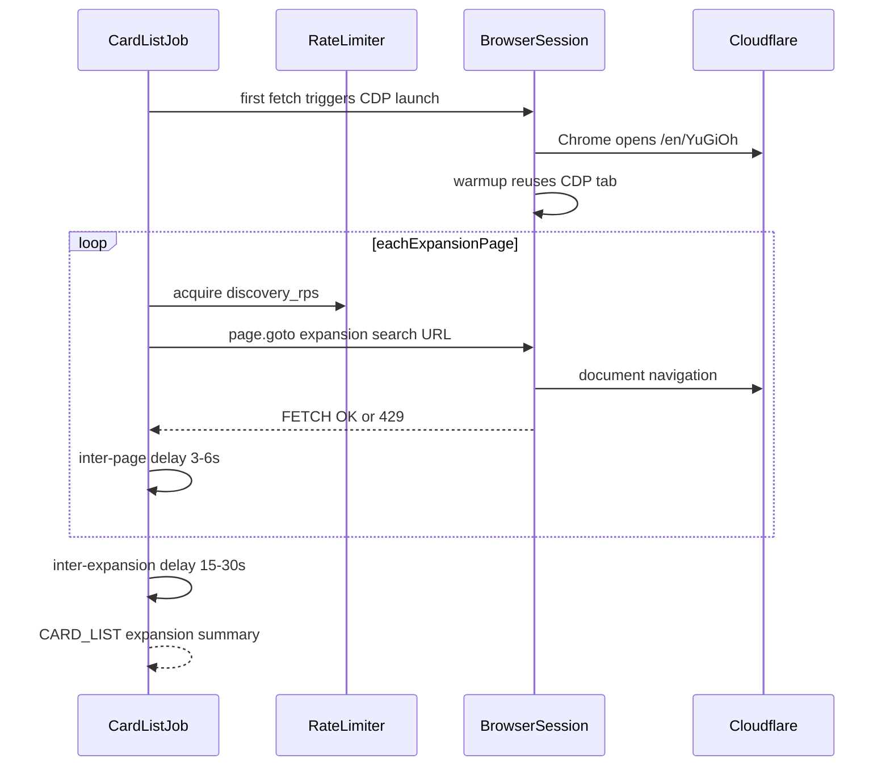

# Cardmarket browser scraper — rate-limit behavior

> **Operational guide** for jobs 2–3 (`scrape_cardmarket_card_list`, `scrape_cardmarket_card_details`) in browser mode.  
> **Last updated:** 2026-06-23  
> Theory and upstream Cloudflare snapshots: [README.md](README.md). Local commands: [LOCAL_DEV.md](../LOCAL_DEV.md).

## Summary

Cardmarket sits behind Cloudflare. **HTTP 429** and **Error 1015** usually mean your **source IP** has exceeded a rate limit — not that a single Chrome profile is “bad.”

Rotating `--browser-profiles` on the **same IP does not reset** an IP-level ban. In fact, launching multiple Chrome instances while already banned **adds requests** and can make recovery slower.

**Verified locally (2026-06-23):**

| Scenario | Result |
|----------|--------|
| Home IP, warmup | HTTP 429 on every profile; 4 Chrome launches in one startup attempt |
| Mobile hotspot (new IP), `--discovery-rps 0.05` | 3/3 expansions, 154 cards, 9 page fetches, ~196 s, no 429 |

The scraper now **fails fast** on warmup 429 (no profile rotation) and logs each successful page fetch as `[FETCH] OK`.

---

## Request flow (job 2, browser mode)



Implementation: [`ygo_app/cardmarket/browser_client.py`](../../ygo_app/cardmarket/browser_client.py) (`BrowserSession`, `_warmup_page_after_launch`, `_navigate_page`) and [`ygo_app/cardmarket/http_client.py`](../../ygo_app/cardmarket/http_client.py) (`fetch_url`, `AdaptiveRateLimiter`).

---

## What counts toward Cloudflare limits

### Rate-limited by our scraper

Each **`page.goto`** to a Cardmarket product search URL goes through `fetch_url` → `AdaptiveRateLimiter.acquire` → `BrowserSession.fetch`. These are the requests you control with `--discovery-rps` / `--rps`.

Job 2 URLs look like:

```text
.../Products/Search?searchMode=v1&idCategory=0&idExpansion={id}&...&site={page}&mode=list
```

### HTTP traffic not gated by our limiter

Still hits Cloudflare from the same IP:

- **CDP Chrome launch** — real Chrome opens `https://www.cardmarket.com/en/YuGiOh` once per session ([`_launch_headed_cdp_browser`](../../ygo_app/cardmarket/browser_client.py)).
- **Warmup** — reuses the CDP tab when possible instead of a second full navigation (`_warmup_page_after_launch`).
- **Subresources** — JS, CSS, images, fonts loaded by the browser on each page (our counter tracks document navigations, not every asset).
- **Cookie consent / CF challenge waits** — may poll the page DOM without a new navigation.

### Pagination (easy to miss)

One expansion = **one or more pages**. The console prints **one summary line per expansion**, but each page is a separate fetch.

Verified example (hotspot run):

| Expansion | Cards | Page fetches |
|-----------|-------|--------------|
| 1651 | 42 | 3 (`site=1..3`) |
| 5420 | 88 | 4 |
| 1433 | 24 | 2 |
| **Total** | **154** | **9** |

So “3 expansions succeeded” can mean **9+ Cloudflare-counted navigations**, plus startup warmup.

---

## Console output guide

| Log prefix | Meaning |
|------------|---------|
| `[BROWSER] launching real chrome via CDP` | Starting one headed Chrome session for this job |
| `[FETCH] OK` | **One successful page navigation** (not one expansion) |
| `[CARD_LIST] expansion … success, N cards` | All pages for that expansion finished |
| `[WARN] browser fetch failed` | Navigation failed; URL shown is **truncated to 80 characters** |
| `[WARN] HTTP 429` | Rate limited; may sleep with backoff or abort on long ban |
| `[THROTTLE] rps=…` | Adaptive slowdown after 403/429 |
| `[ABORT] Long rate limit` | `Retry-After >= 600` s — checkpoint saved, job exits |
| `[ERROR] browser startup failed` | Could not start browser (often IP already 429 at warmup) |

### Misleading truncated URLs

Failed-fetch lines look like:

```text
[WARN] browser fetch failed https://www.cardmarket.com/en/YuGiOh/Products/Search?searchMode=v1&idCategory=0&: HTTP 429
```

All product search URLs share the same first 80 characters (`idCategory=0&`). This is **not** necessarily the expansion-list `SEARCH_URL` — it is usually an expansion page (`idExpansion=…`) cut off by logging. Use `[FETCH] OK` lines and expansion summaries to see real progress.

---

## Profile pool (`--browser-profiles`)

**Purpose:** isolated Chrome user-data directories and cookie stores under `data/catalog/cardmarket_profiles/{name}/`. Useful when you need separate saved sessions — **not** for bypassing IP bans.

State file: `data/catalog/cardmarket_profile_state.json` (`active`, `pool`, `burned`).

**June 2026 behavior:** if warmup returns HTTP 429, the scraper **does not rotate profiles**. It logs a hint, raises `RateLimitAbort`, and exits (checkpoint preserved). Previously, rotating through 4 profiles on a banned IP launched 4 Chromes and made things worse.

Profiles may still help when a **specific cookie/session** is flagged while the IP is fine — rare compared to IP-level blocks.

---

## Pacing defaults

From [`ygo_app/cardmarket/constants.py`](../../ygo_app/cardmarket/constants.py):

| Setting | `--polite` / browser default |
|---------|----------------------------|
| `discovery_rps` | 0.12 (~1 request every 8 s) |
| `price_rps` | 0.2 |
| `workers` | 1 |
| Inter-request delay (browser) | **2–8 s** random after each successful navigation |
| Inter-expansion delay (browser) | 15–30 s random |
| Checkpoint interval | **every 5** expansions (job 2) or cards (job 3) |

Randomized delays between requests matter more than rotating browser sessions on the same IP — Cloudflare counters are usually keyed by source IP, not session length.

Cloudflare’s [anti-scraping examples](best-practices.md#prevent-content-scraping-via-query-string) cite **~10 requests / 2 minutes** (~0.08 RPS). For recovery or large catalog runs, prefer:

```powershell
--discovery-rps 0.05   # verified stable on fresh IP
# or
--discovery-rps 0.08   # aligns with CF doc example
```

Override via CLI or `.env` (`CARDMARKET_DISCOVERY_RPS`, `CARDMARKET_PRICE_RPS`, `CARDMARKET_WORKERS`).

### Legacy vs current scraper

[`cardmarket/cardmarket_card_list_scraper.py`](../../cardmarket/cardmarket_card_list_scraper.py) used **cloudscraper** HTTP at **3 RPS / 8 workers** — one lightweight GET per page, no full browser. That was faster on paper but often fails today when Cloudflare blocks automated HTTP unless `cf_clearance` works in curl_cffi.

**Browser mode** (`--browser --headed`) uses real Chrome via CDP — heavier per step but passes bot checks when HTTP cannot. Use browser mode when `--cf-login` succeeds in Chrome but the curl_cffi probe fails.

---

## 429 handling in code

| Mechanism | Location | Behavior |
|-----------|----------|----------|
| `AdaptiveRateLimiter` | `http_client.py` | Slows down on 403/429; recovers after success streak |
| `_sleep_for_429` | `http_client.py` | Honors `Retry-After`; exponential backoff if absent |
| `RateLimitAbort` | `http_client.py` | Long ban (`Retry-After >= 600` s) → checkpoint + exit code 2 |
| Warmup fail-fast | `browser_client.py` | Warmup 429 → `RateLimitAbort`, no profile rotation |
| `_warmup_page_after_launch` | `browser_client.py` | Reuse CDP landing tab; skip duplicate warmup goto |
| Checkpoint on abort | `card_list_scrape.py` | Saves progress before exit |
| Periodic checkpoint | jobs 2–3 | Every **5** expansions/cards + on Ctrl+C (job 2) |

---

## Troubleshooting

### 429 at warmup before any expansion

Your **IP is already banned** from earlier scraping (or shared network traffic). Do **not** retry with multiple `--browser-profiles` on the same connection.

1. Stop scraping.
2. Open https://www.cardmarket.com in your **normal browser** (not scrape Chrome). If Error 1015 persists, wait longer (often ~1 hour).
3. Clear `"burned": []` in `cardmarket_profile_state.json` if old burns confuse you.
4. Resume on the same IP with `--discovery-rps 0.05`, or use a **different egress IP** (e.g. mobile hotspot) once the ban lifts elsewhere.

### One expansion succeeds, then 429

Usually the **next page or next expansion** hit the limit — not a bug in the first expansion. Compare `[FETCH] OK` count to `[CARD_LIST]` lines. You may need lower RPS or a cooldown.

### Recovery checklist

1. **Wait** for ban expiry; verify in normal browser.
2. **Optional:** change egress IP (hotspot, different network).
3. Reset burned profiles in `cardmarket_profile_state.json` if needed.
4. Resume:

```powershell
python -m ygo_app.jobs.scrape_cardmarket_card_list --browser --headed --polite --resume --discovery-rps 0.05
```

5. Watch for `[FETCH] OK` per page; expect **multiple fetches per expansion**.

---

## Related docs

- [Cloudflare README — project reference](README.md)
- [LOCAL_DEV.md — Cardmarket pipeline](../LOCAL_DEV.md#cardmarket-prices-local-scrape)
- [agent_handoff.md — Cardmarket jobs](../../agent_handoff.md)
