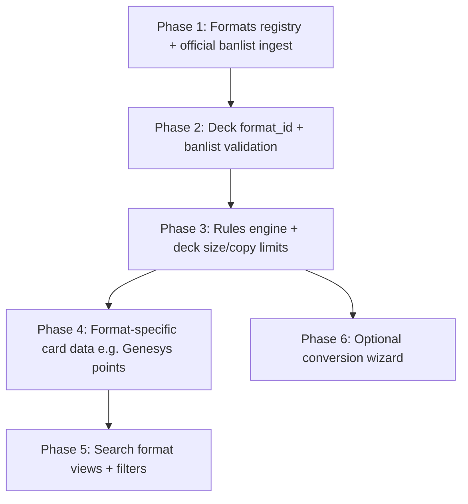

# Future must-have features

Planning notes for format-aware deck building, banlists, and validation. Not scheduled for implementation yet.

---

## 1. Format banlist & limit list module

### Goal

Track **banlists** (Forbidden / Limited / Semi-Limited) and **limit lists** per Yu-Gi-Oh! format so deck validation and search can reflect what is legal in the chosen format.

### Key constraints

| Challenge | Implication |
|-----------|-------------|
| **One list per format** | Each format needs its own data source and likely its own API route or ingest job (e.g. `GET /api/formats/{id}/banlist`, not a single global endpoint). |
| **Official vs fandom formats** | Official formats (TCG Advanced, TCG Traditional, OCG, Master Duel, etc.) must be sourced from **official or primary publisher sources** (Konami, regional sites, sanctioned event docs). Fandom/community formats (Edison, Goat, HAT, etc.) need clearly labeled unofficial sources or manual curation. |
| **Lists change over time** | Store **effective date** (or banlist revision id) so decks can be validated “as of” a given list; historical lists matter for retro formats. |
| **Card identity** | Lists are passcode-based; align with existing `cards.id` (8-digit passcode). Handle reprints and alternate names in UI only — one row per passcode in validation. |

### Suggested data model (high level)

- `formats` — id, name, category (`official` \| `community`), ruleset reference, active banlist revision
- `banlist_revisions` — format_id, effective_from, source_url, fetched_at
- `banlist_entries` — revision_id, card_id (passcode), status (`forbidden` \| `limited` \| `semi_limited` \| `unlimited`)

### Ingestion

- Separate fetchers per official source where APIs/HTML differ; normalize into the schema above.
- Community formats: optional manual import (CSV/JSON) or trusted third-party mirrors, always tagged `community` in UI.
- Job to refresh official lists on a schedule; surface “last updated” in the app.

### Open research

- [ ] Catalog official TCG/OCG/Master Duel banlist publication URLs and update frequency
- [ ] Decide which community formats to support at launch vs later
- [ ] Whether Master Duel / simulators use the same passcode list as paper TCG

---

## 2. Deck feature: format selection

### Current state

Decks have `name`, `description`, zones (`main` / `extra` / `side`), and quantities. **No format field** and no legality checks.

### Required change

When creating or editing a deck, the user **chooses a format** (e.g. Advanced TCG, Edison, Genesys). That choice drives:

- Which banlist/limit list applies
- Which **deck-building rules** apply (see §3)
- Validation messages in the deck editor (illegal cards, wrong counts, point budget, etc.)

### Schema sketch

- Add `format_id` (FK) on `decks`, defaulting to a sensible official default (e.g. Advanced TCG) for new decks.
- Deck list API returns format metadata + validation summary (optional `warnings` / `errors` array).

### UI

- Format selector on deck create and in deck editor header (alongside deck name).
- Show format badge on deck sidebar items.
- Card modal “Add to deck” could respect global or deck format when showing legality hints (later).

---

## 3. Format rules engine

### Goal

**Rules must be defined per format** so the app can enforce whether a deck is legal, not only whether cards are on a banlist.

### Examples of rule dimensions

| Rule type | Advanced TCG (example) | Genesys (example) |
|-----------|------------------------|-------------------|
| Main / Extra / Side sizes | 40–60 / max 15 / max 15 | TBD per official Genesys doc |
| Copy limits | Banlist + 3 default | Per-card limits + point cap |
| Point budget | N/A | Sum of card point values ≤ 100 |
| Card pool | TCG release + banlist | Genesys-legal pool + point values |
| Extra deck typing | Standard monster rules | Format-specific |

### Implementation direction

- **`FormatRules` abstraction** (Python): each format registers validators (deck size, zone sizes, banlist, custom e.g. point total).
- Rules live in code or config (YAML/JSON) versioned with the app; banlist data stays in DB and updates independently.
- Validation runs on: add/remove card, change zone, change format, export/share deck.
- Return structured errors: `{ code, message, card_id?, zone? }` for UI chips and tooltips.

Genesys and other **non-banlist-only** formats are the main reason a simple “banlist overlay on current deck code” is insufficient — see §5.

---

## 4. Deck conversion between formats

### Question

Is a **convert deck from format A → format B** feature required?

### Recommendation (for planning)

| Approach | When to use |
|----------|-------------|
| **Change format in place** (re-validate, keep cards) | Default. User switches format; app marks illegal cards, over-limit copies, and rule violations. User fixes manually. Low complexity, always correct. |
| **Guided conversion wizard** | Optional UX on top: “Convert to Edison” → show diff (removed forbidden, trimmed to 3-of, suggest replacements). No automatic silent changes. |
| **Full automatic conversion** | **Not recommended** as primary flow — different formats differ in card pool, points, and side rules; auto-swap is ambiguous and can surprise users. |

**Suggested MVP:** format switch + clear validation report. **Phase 2:** optional wizard that highlights changes and offers search for replacements. Document as open product decision until user testing.

---

## 5. Integration / architecture rethink

Some formats are not “standard Yu-Gi-Oh deck + banlist”:

- **Genesys** — each card has a **point value 0–100**; deck has a **maximum 100 points** total (plus other Genesys-specific rules). Requires:
  - Extra card metadata per format (or per format overlay table): `genesys_points`, etc.
  - Deck validator that sums points across Main + Extra (+ Side if applicable).
  - UI showing point cost on chips and running total.

This implies:

1. **Format-specific card attributes** — either columns on `cards` for widely used fields, or `format_card_data(format_id, card_id, json)` for extensibility.
2. **Validators are pluggable** — banlist check is one plugin; point cap is another.
3. **API** — `GET /api/cards/{id}?format=genesys` or include format context in search/deck endpoints so the client gets the right fields.

Avoid hard-coding Genesys only; design for N formats with different rule plugins and optional per-format card overlays.

---

## 6. Search tab: format-aware views

### Idea

Let the user pick a **view / format context** on Search (global or tied to active deck format) so **different card attributes are emphasized** depending on format.

### Examples

| View / format | Highlighted attributes |
|---------------|------------------------|
| Default / Advanced | Type, attribute, level, ATK/DEF, archetype (current behavior) |
| Genesys | Point value, legality in Genesys pool, point-efficient staples |
| Edison / retro | Release-era tags, historical banlist status |
| Master Duel | Banlist status, UR/SR craft relevance (if data exists) |

### UI options

- **Format selector** in search header or advanced panel (“Search as: Advanced | Genesys | …”).
- **Column / badge overlays** on result cards (e.g. red “Forbidden”, yellow “Limited”, Genesys points badge).
- Filters: “Legal in selected format only”, “Hide forbidden”.

### Dependencies

- Banlist module (§1) and format card metadata (§5) must exist before views are meaningful.
- Search API may need `format_id` query param and extra fields in `card_summaries` batch response.

---

## 7. Suggested implementation phases

1. **Formats registry** — define formats, official sources, ingest first banlist (e.g. TCG Advanced).
2. **Deck `format_id`** — UI selector; validate against banlist only.
3. **Rules engine** — deck sizes, copy limits, structured errors in deck editor.
4. **Per-format card data** — Genesys points, etc.; point-budget validator.
5. **Search views** — format context, legality badges, format-specific filters.
6. **Conversion wizard** (optional) — diff + suggestions when changing deck format.

---

## 8. Open decisions (track here)

- [ ] Initial format list for v1 (which official + which community formats)
- [ ] Convert feature: in-place re-validate only vs guided wizard (see §4)
- [ ] Single global “search format” vs per-deck format when adding cards from modal
- [ ] Where Genesys (and similar) point values are sourced and how often updated
- [ ] Whether fandom formats are in scope for v1 or official-only first
- [ ] Historical banlists for Edison/Goat vs “current list only” for Advanced

---

## 9. Relation to current codebase

| Area | Today | Future |
|------|--------|--------|
| `decks` model | No format | `format_id` + validation hooks |
| Deck UI | Main/Extra/Side counts only | Format selector, legality/errors, point total (Genesys) |
| Card modal | Add to deck + zone | Optional legality hint for target deck’s format |
| Search | Yugipedia filters | Format view + banlist/point badges |
| API | `/api/decks/*` | `/api/formats/*`, format-scoped banlist and card fields |

---

*Last updated: 2026-06-09 — initial roadmap from format/banlist requirements discussion.*
