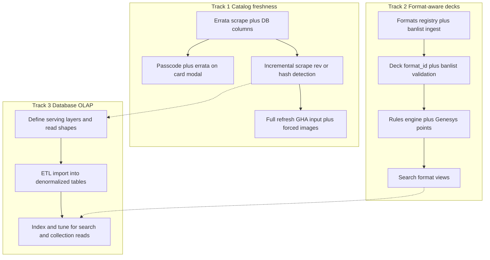

# Future must-have features

Agent-readable backlog of planned work. Not scheduled for implementation yet. Use this document when scoping or implementing a feature — each section follows **Goal / Current state / Required change / Open research** where applicable.

**Last updated:** 2026-07-01

---

## Topic index

| Section | Topic |
|---------|--------|
| [A. Catalog pipeline](#a-catalog-pipeline) | Errata, incremental vs full scrape, R2 JSON decision |
| [B. Card details UI](#b-card-details-ui) | Passcode display, errata on card modal |
| [C. Format and banlist](#c-format-and-banlist) | Banlist module, deck format, rules engine, per-format card data |
| [D. Search and deck conversion](#d-search-and-deck-conversion) | Format-aware search, conversion between formats |
| [F. Database architecture](#f-database-architecture-olap--analytics) | OLAP read store, supervised data engineering, denormalization |
| [G. Multi-language catalog and localization](#g-multi-language-catalog-and-localization) | Regional printings, card images per language, portal i18n, storage budget |
| [H. Scalability and infrastructure](#h-scalability-and-infrastructure) | High user scale, performance, HA, backups, load balancing |
| [I. Mobile applications](#i-mobile-applications) | Native iOS and Android clients |
| [J. Card scanner (OCR)](#j-card-scanner-ocr) | Card-number OCR + rarity picker instead of image recognition |
| [E. Meta](#e-meta) | Implementation phases, open decisions, relation to codebase |

---

## A. Catalog pipeline

### A.1 Errata data

#### Goal

Store **errata** (official text changes over time) in the database and surface them in the webapp so users can tell whether a physical card may show **outdated text**.

#### Current state

- Card text comes from Yugipedia `.lore` only ([`ygo_app/yugipedia/parsing.py`](ygo_app/yugipedia/parsing.py) `extract_lore_description`).
- No errata fields in scrape JSON, Neon `cards`, or API/UI.
- `cards.id` is the 8-digit passcode (same identity used everywhere).

#### Required change

1. **Scrape** — Extract errata from Yugipedia card pages (research exact HTML sections; likely separate from `.lore` errata/history blocks).
2. **Database** — Persist on Neon (not scrape JSON alone):
   - Suggested columns on `cards`: `has_errata` (bool), `errata` (JSON array: `effective_date`, `summary`, `previous_text`, `current_text`, `source_url`), `catalog_updated_at`, `wiki_rev_id` (for change detection).
   - Alternative: `card_errata` table if per-revision rows must be queryable; start with JSON on `cards` unless needed.
3. **Import** — Extend [`ygo_app/yugipedia/card_import.py`](ygo_app/yugipedia/card_import.py) + Alembic migration; full re-import after schema change (same pattern as migration `003`).

#### Open research

- [ ] Map Yugipedia errata HTML structure per card type (Monster / Spell / Trap / Skill).
- [ ] Yugipedia-only vs also ingesting Konami official errata pages.
- [ ] Whether `errata` JSON should store full previous text or summary + link only.

---

### A.2 Incremental vs full scrape

#### Goal

Support **incremental** catalog updates on schedule (rate-limited; ~2–4 h full run is not viable every time) while allowing **manual full refresh** when errata or bulk wiki changes require re-scraping every card.

#### Current state

| Piece | Behavior today |
|-------|----------------|
| Passcode list | Full replace each run ([`passcodes.py`](ygo_app/yugipedia/passcodes.py)) |
| Details scrape | `--resume` **skips passcodes already in** `yugipedia_all_cards.json` ([`details.py`](ygo_app/yugipedia/details.py)) — not “refresh if wiki changed” |
| Image mirror | Incremental; `--force` remirrors all ([`sync_card_images.py`](ygo_app/jobs/sync_card_images.py)) |
| Import | Full replace of `cards` + `printings` ([`import_data.py`](ygo_app/import_data.py)) |

#### Required change — two explicit modes

| Mode | Trigger | Passcodes | Images | Import |
|------|---------|-----------|--------|--------|
| **Incremental** (scheduled default) | GHA schedule / normal run | New passcodes from passcode list + cards flagged **stale** (wiki rev change, errata, or `scraped_at` TTL) | Mirror only missing R2 keys (current behavior) | Upsert changed cards; avoid full delete when possible (**open design**) |
| **Full** (manual) | GHA `workflow_dispatch` e.g. `full_refresh=true` | Re-scrape **all** passcodes (ignore resume skip) | `--force` remirror all (or affected subset after errata pass) | Full replace (current `import_cards_entries` behavior) |

**Constraints**

- Rate limiting (~3 req/s) cannot be optimized further; incremental is the only viable scheduled path ([`agent_handoff.md`](agent_handoff.md) §4).
- Errata changes **text and often card art** → full or targeted refresh must chain details re-scrape + forced image sync for affected passcodes.
- **Change detection (recommended):** store `wiki_page_rev_id` or content hash per card at scrape time; incremental run re-queues passcodes where rev differs. MediaWiki API can supply `revid` without full HTML fetch for a cheap pre-pass (not implemented today).

#### GHA / CLI surface (planning)

- New workflow input: `full_refresh` (boolean, default `false`).
- CLI on [`scrape_yugipedia_catalog.py`](ygo_app/jobs/scrape_yugipedia_catalog.py): `--incremental` (default) vs `--full-refresh` (clears resume skip).
- Document interaction with existing `test_mode`, `BATCH_COUNT=6` batch jobs, and `images` job.
- Sync workflow YAML on `main` and `develop` per [`.cursor/rules/github-actions-yugipedia-workflow-sync.mdc`](.cursor/rules/github-actions-yugipedia-workflow-sync.mdc).

#### Open research

- [ ] Incremental import: upsert vs always full replace.
- [ ] How often to run manual full refresh (quarterly vs errata-driven only).
- [ ] Stale detection: wiki `revid` pre-pass vs content hash vs TTL fallback.

---

### A.3 R2 storage for card-details JSON

#### Question

Should per-card Yugipedia JSON (`yugipedia_all_cards.json` slice or per-passcode files) live in **Cloudflare R2**?

#### Recommendation

**Do not use R2 as the runtime source for card details.** Optional use as a **pipeline checkpoint** only.

| Use case | R2? | Rationale |
|----------|-----|-----------|
| Webapp / API (text, errata, stats) | **No** — Neon via FastAPI | Queryable, indexed, consistent with search/collection |
| Card images | **Yes** — already `cards/{passcode}.webp` | CDN-friendly, immutable ([`agent_handoff.md`](agent_handoff.md) §5) |
| Scrape checkpoint / backup JSON | **Optional** | Durable beyond 14-day GHA `catalog-state` artifact; disaster recovery and scrape-vs-import debugging |
| Per-card incremental merge | **Optional later** | Keys e.g. `catalog/cards/{passcode}.json`; adds complexity vs DB `wiki_rev_id` + re-scrape queue |

**Primary catalog truth for the app:** Neon `cards` (+ errata fields). Scrape JSON remains an **ephemeral pipeline artifact** (`data/catalog/` + GHA artifact). If R2 JSON is added later, use prefix `catalog/` separate from `cards/*.webp` images.

---

## B. Card details UI

Card details are shown in the **card modal** (`#card-modal` in [`index.html`](ygo_app/static/index.html)), hydrated via `GET /api/cards/{id}` ([`app.js`](ygo_app/static/js/app.js) `openCardModal` / `renderModalCard`).

### B.1 Passcode visibility

#### Goal

Show the **8-digit passcode** on the card details view so users can identify cards unambiguously (collection CSV, trade, lookup).

#### Current state

- API `CardDetail.id` is the passcode ([`schemas.py`](ygo_app/schemas.py)).
- UI `formatModalStats()` does not display `card.id`.

#### Required change

- Add passcode under the card name (e.g. `Passcode 85087012`); optional copy-to-clipboard.
- **No API change required** unless copy UX needs a dedicated endpoint.
- Files: [`index.html`](ygo_app/static/index.html), [`app.js`](ygo_app/static/js/app.js); bump static `?v=` after edits.

---

### B.2 Errata on card details

#### Goal

When a card has errata, show it on the **card details page** so users know physical copies may show outdated information.

#### Current state

No errata in API or modal (depends on [A.1](#a1-errata-data)).

#### Required change

- When `has_errata` / `errata` present: section below description — e.g. “This card has errata”, list of changes, note that owned copies may differ.
- Optional link to Yugipedia `source_url` from errata payload.
- Extend `CardDetail` schema + `renderModalCard()` once DB fields exist.

---

## C. Format and banlist

### C.1 Banlist and limit list module

#### Goal

Track **banlists** (Forbidden / Limited / Semi-Limited) and **limit lists** per format for deck validation and search.

#### Key constraints

| Challenge | Implication |
|-----------|-------------|
| One list per format | Separate data source and route per format (e.g. `GET /api/formats/{id}/banlist`) |
| Official vs community | Official (Advanced, Traditional, OCG, Master Duel) from publisher sources; community (Edison, Goat, HAT) clearly labeled unofficial |
| Lists change over time | Store **effective date** / revision id; historical lists for retro formats |
| Card identity | Passcode-based; align with `cards.id` ([§A](#a-catalog-pipeline)); one row per passcode in validation |

#### Suggested data model

- `formats` — id, name, category (`official` \| `community`), ruleset reference, active banlist revision
- `banlist_revisions` — format_id, effective_from, source_url, fetched_at
- `banlist_entries` — revision_id, card_id (passcode), status (`forbidden` \| `limited` \| `semi_limited` \| `unlimited`)

#### Ingestion

- Separate fetchers per official source; normalize into schema above.
- Community formats: manual CSV/JSON or trusted mirrors, tagged `community` in UI.
- Scheduled refresh; surface “last updated” in app.

#### Open research

- [ ] Official TCG/OCG/Master Duel banlist URLs and update frequency
- [ ] Community formats at launch vs later
- [ ] Master Duel passcode list vs paper TCG

---

### C.2 Deck format selection

#### Current state

Decks: `name`, `description`, zones (`main` / `extra` / `side`), quantities. **No format field**, no legality checks.

#### Required change

User **chooses a format** on create/edit (e.g. Advanced TCG, Edison, Genesys). Drives:

- Banlist / limit list ([C.1](#c1-banlist-and-limit-list-module))
- Deck-building rules ([C.3](#c3-format-rules-engine-and-deck-conversion))
- Validation messages in deck editor

#### Schema / UI

- `decks.format_id` (FK), default e.g. Advanced TCG.
- API: format metadata + optional `warnings` / `errors` on deck responses.
- UI: format selector on create/edit; format badge on deck sidebar; later — legality hints in card modal “Add to deck”.

---

### C.3 Format rules engine and deck conversion

#### Goal

**Rules per format** — legality is not banlist-only (deck sizes, copy limits, point budgets, card pools).

#### Rule dimensions (examples)

| Rule type | Advanced TCG | Genesys |
|-----------|--------------|---------|
| Main / Extra / Side | 40–60 / max 15 / max 15 | Per official doc |
| Copy limits | Banlist + 3 default | Per-card limits + point cap |
| Point budget | N/A | Sum of card points ≤ 100 |
| Card pool | TCG + banlist | Genesys pool + point values |

#### Implementation direction

- **`FormatRules`** (Python): validators for deck size, zones, banlist, custom (e.g. point total).
- Rules in code/config; banlist data in DB, updated independently.
- Validate on: add/remove card, zone change, format change, export.
- Structured errors: `{ code, message, card_id?, zone? }`.

#### Deck conversion between formats

| Approach | When |
|----------|------|
| **Change format in place** (re-validate, keep cards) | **Default MVP** — mark illegal cards, over-limit copies; user fixes manually |
| **Guided conversion wizard** | Phase 2 — diff + suggestions; no silent auto-changes |
| **Full automatic conversion** | **Not recommended** — ambiguous across pools and side rules |

---

### C.4 Per-format card metadata (architecture)

Some formats need more than banlist + standard stats (e.g. **Genesys** point values 0–100, deck cap 100 points).

Requires:

1. **Format-specific attributes** — columns on `cards` or `format_card_data(format_id, card_id, json)`.
2. **Pluggable validators** — banlist plugin; point-cap plugin; etc.
3. **API** — `GET /api/cards/{id}?format=genesys` or format context on search/deck endpoints.

Design for N formats; avoid Genesys-only hard-coding.

---

## D. Search and deck conversion

### D.1 Format-aware search views

#### Goal

**Search as format X** — emphasize different attributes per format context.

| View / format | Highlighted attributes |
|---------------|------------------------|
| Default / Advanced | Type, attribute, level, ATK/DEF, archetype (current) |
| Genesys | Point value, pool legality, point-efficient staples |
| Edison / retro | Release-era, historical banlist |
| Master Duel | Banlist, craft tier (if data exists) |

#### UI / API

- Format selector in search header or advanced panel.
- Badges on results (Forbidden, Limited, Genesys points).
- Filters: “Legal in format”, “Hide forbidden”.
- Depends on [C.1](#c1-banlist-and-limit-list-module) and [C.4](#c4-per-format-card-metadata-architecture).
- Search API: optional `format_id`; extra fields in `card_summaries` batch.

---

## F. Database architecture (OLAP / analytics)

### F.1 Supervised OLAP serving layer

#### Goal

- Database architecture is **explicitly designed and supervised** — not an accidental OLTP schema reused for analytics.
- Primary purpose: **serve analytical and read-heavy workloads** (search, filters, collection browse, format/banlist views, future aggregations).
- **OLAP, not OLTP**: favor star/snowflake or wide denormalized tables, pre-joined dimensions, materialized aggregates; separate or clearly layered from small transactional user writes if needed.
- **Read speed over normalization**: denormalization, redundant columns, precomputed fields, and duplicate storage are **acceptable** when they reduce join depth or query latency.
- Follow **data engineering best practices**: batch ingest, idempotent loads, clear lineage (scrape → staging → serving layer), versioning/`catalog_updated_at`, indexes/partitioning tuned for read patterns, documented refresh SLAs.

#### Current state

- Single Neon Postgres; normalized `cards` + `printings`; full catalog replace on import ([`import_data.py`](ygo_app/import_data.py)).
- API reads and user CRUD share the same tables ([`services.py`](ygo_app/services.py), [`search_query.py`](ygo_app/search_query.py)).
- No separate serving/analytics layer, materialized views, or columnar store.

#### Required change

- Define **layers**: e.g. raw/staging (pipeline artifacts) → **serving OLAP store** (app reads) → optional small OLTP pocket for user mutations synced into serving layer.
- Catalog import becomes **ETL into read-optimized shapes** (wide card rows, pre-resolved printings summaries, search facets as columns or side tables).
- Indexing and schema reviews driven by **read query profiles** (search filters, collection joins, banlist lookups from [C.1](#c1-banlist-and-limit-list-module)).
- Document refresh model: batch rebuild acceptable; incremental upsert where it reduces downtime ([A.2](#a2-incremental-vs-full-scrape) incremental import aligns here).
- Explicit **non-goals**: optimizing for high-frequency row-level writes or strict 3NF normalization.

#### Open research

- [ ] Keep OLAP in **Neon Postgres** (materialized views, denormalized tables) vs add a dedicated analytics engine later.
- [ ] Split **catalog OLAP** vs **per-user data** (collection/decks) — same DB with schemas vs separate stores.
- [ ] How much denormalization on `cards` vs companion `card_search` / `card_printings_flat` tables.
- [ ] Refresh cadence vs API consistency guarantees during import.

---

## G. Multi-language catalog and localization

### G.1 Regional sets and printings

#### Goal

Optionally track **sets and printings per language/region** (e.g. TCG English, OCG Japanese, European languages) so collectors can see which regional release a copy belongs to, including **language-specific card numbers** on the printing row.

#### Current state

- Printings are keyed primarily by set + rarity + passcode; regional/language variants are not first-class.
- Card images are one WebP per passcode in R2 (`cards/{passcode}.webp`), sourced from Yugipedia English pages.
- Yugipedia coverage for non-English card art is **incomplete and often outdated** compared to the latest TCG/OCG releases.

#### Required change (if pursued)

1. **Scrape / ingest** — Per-language set data and **distinct card numbers** per regional printing (not just passcode).
2. **Data model** — `language` or `region` on `printings` (or a `printing_locales` table); avoid exploding one card into hundreds of flat printing rows in the default UI.
3. **Card details UI** — In the **All printings** pane, use **tabs by language/region** instead of one long list of every regional variant under a single card.
4. **Images** — Open decision: store **per-language card images** in R2 (e.g. `cards/{passcode}_{locale}.webp`) vs keep a single canonical image per passcode.

#### Open research

- [ ] **English-only portal** vs **full portal i18n** (UI strings, card names, card text in the user’s language). English-only is simpler; full i18n multiplies scrape, cache, and QA surface.
- [ ] Whether regional printings are **metadata-only** (set code + card number + language) with shared art, or **separate image assets** per locale.
- [ ] Yugipedia vs Cardmarket S3 / other sources for non-English art and set numbers.
- [ ] **Storage budget** — Neon is capped at **~5 GB**. Estimate before committing:
  - DB: extra printing rows, localized names/text JSON, indexes (likely modest if denormalized carefully).
  - R2: dominant cost if every passcode × locale gets a WebP (~50–150 KB each × N languages × ~10k+ cards scales quickly; images belong in R2/CDN, not Postgres blobs).
  - Rule of thumb: **one image per passcode in DB is wrong**; **one image per passcode × locale in R2** can be tens of GB at full catalog × many languages — needs tiering (canonical EN only, on-demand mirror for other locales, or user-uploaded overrides).
- [ ] UI default: show **user’s region/language tab first**; hide empty locales when Yugipedia has no art.

#### Recommendation (planning)

Treat **regional printing metadata** (card number, set, language) as higher priority than **per-locale images**. Start with language **tabs in All printings** and English canonical art; add locale-specific images only where sources are reliable and storage/CDN budget allows.

---

## H. Scalability and infrastructure

### H.1 Scale to thousands or millions of users

#### Goal

Architecture that supports **large user growth** (thousands → millions) without redesigning core paths: search, collection, decks, auth, and catalog reads.

#### Current state

- Single Neon Postgres instance; FastAPI app; catalog and user data largely share one database ([F.1](#f1-supervised-olap-serving-layer)).
- No documented horizontal scaling, read replicas, or multi-region deployment.
- Scheduled jobs (Yugipedia scrape, Cardmarket S3 sync) run on GHA, not user-request path.

#### Required change

1. **Performance** — Define SLOs (p95 API latency, search timeout); profile hot queries; align with OLAP read shapes ([F.1](#f1-supervised-olap-serving-layer)); CDN for static assets and card images; connection pooling and query limits.
2. **Read scaling** — Read replicas or dedicated **catalog read** vs **user write** separation as traffic grows; cache layer (e.g. Redis) for session, rate limits, and hot catalog keys.
3. **App tier** — Stateless API behind load balancer; multiple workers/containers; no local filesystem state for user sessions.
4. **High availability** — **Backup servers** and **database backups** with tested restore; failover plan for Neon/outage (RPO/RTO targets).
5. **Load balancing** — LB in front of API; optional geo routing later; job queue for async work (imports, notifications) so spikes do not block requests.

#### Open research

- [ ] Neon plan limits (connections, storage, read replicas) vs migrate catalog OLAP to a larger provider later.
- [ ] When to introduce Redis vs Postgres-only caching.
- [ ] Multi-region: required for global latency or single-region + CDN sufficient for v1 scale.
- [ ] Cost model at 10k / 100k / 1M MAU (DB size, egress, R2, compute).

---

## I. Mobile applications

### I.1 Native iOS and Android clients

#### Goal

Dedicated **mobile apps** (iOS App Store, Google Play) for collection management, deck building, and card lookup — sharing the same backend API as the web portal.

#### Current state

- Web-only UI ([`ygo_app/static/`](ygo_app/static/)); responsive layout may exist but no native apps.

#### Required change (if pursued)

- **API-first** — Ensure all collection/deck/search flows are available via stable, versioned REST (or GraphQL) with mobile-friendly pagination and auth (OAuth / token refresh).
- **Clients** — Native (Swift/Kotlin) or cross-platform (React Native, Flutter); offline cache for owned collection is a common expectation on mobile.
- **Parity** — Card images via existing R2/CDN URLs; push notifications (price alerts, banlist updates) optional later.
- **Release** — Store compliance, privacy policy, and separate CI for mobile builds.

#### Open research

- [ ] Native vs cross-platform given team size and feature parity with web.
- [ ] Offline mode scope (read-only collection vs full deck editor).
- [ ] Shared auth with web (same user account).

---

## J. Card scanner (OCR)

### J.1 Card-number scanner instead of image recognition

#### Goal

A **scanner** feature (likely in the mobile app) that identifies cards quickly without training a full **image-based** card classifier.

#### Proposed approach

1. **OCR the printed card number** (set code + collector number on the card frame) via camera — simpler and more reliable than matching artwork across thousands of printings and rarities.
2. User **selects rarity** (or printing) from a short list when OCR maps to multiple printings with the same number in different sets.
3. Resolve to passcode + printing via catalog DB ([G.1](#g1-regional-sets-and-printings) regional numbers matter here).

#### Current state

- No scanner; no OCR pipeline in repo.

#### Required change (if pursued)

- Mobile camera UX + on-device or server OCR (Tesseract, ML Kit, or cloud OCR).
- Lookup API: `GET /api/printings/by-number?set=...&number=...` or fuzzy match on normalized OCR text.
- Handle OCR errors (checksum, font, glare) with manual correction UI.

#### Open research

- [ ] On-device vs server OCR (privacy, latency, cost).
- [ ] Whether set code is always visible in one OCR pass or needs a second crop.
- [ ] Training data: not required for card **art**; may need font/layout tuning per card era.
- [ ] Relation to [I.1](#i1-native-ios-and-android-clients) — scanner is a natural mobile-first feature.

#### Recommendation (planning)

Prefer **card-number OCR + rarity picker** over image classification: lower ML cost, easier maintenance, aligns with multi-language printings if numbers are scraped per locale ([G.1](#g1-regional-sets-and-printings)).

---

## E. Meta

### E.1 Implementation phases

Two parallel tracks (catalog freshness can proceed independently of format work). **OLAP serving design** ([F.1](#f1-supervised-olap-serving-layer)) should precede or accompany incremental import and format-aware search to avoid rework.

```mermaid
flowchart TB
  subgraph trackCatalog [Track 1 Catalog freshness]
    C1[Errata scrape plus DB columns]
    C2[Passcode plus errata on card modal]
    C3[Incremental scrape rev or hash detection]
    C4[Full refresh GHA input plus forced images]
    C1 --> C2
    C1 --> C3 --> C4
  end
  subgraph trackFormats [Track 2 Format-aware decks]
    F1[Formats registry plus banlist ingest]
    F2[Deck format_id plus banlist validation]
    F3[Rules engine plus Genesys points]
    F4[Search format views]
    F1 --> F2 --> F3 --> F4
  end
  subgraph trackData [Track 3 Database OLAP]
    D1[Define serving layers and read shapes]
    D2[ETL import into denormalized tables]
    D3[Index and tune for search and collection reads]
    D1 --> D2 --> D3
  end
  C3 -.-> D1
  F4 -.-> D3
```

**Track 1 — Catalog**

1. Errata scrape + DB columns + import mapping.
2. Passcode + errata on card modal.
3. Incremental scrape with wiki rev / hash stale detection.
4. Manual full refresh (GHA input + forced image remirror).

**Track 2 — Formats**

1. Formats registry + first official banlist ingest (e.g. TCG Advanced).
2. Deck `format_id` + banlist-only validation.
3. Rules engine (sizes, copies) + per-format card data (Genesys points).
4. Search format views + filters; optional conversion wizard ([C.3](#c3-format-rules-engine-and-deck-conversion)).

**Track 3 — Database (OLAP)**

1. Define serving layers and read-optimized shapes ([F.1](#f1-supervised-olap-serving-layer)).
2. ETL catalog import into denormalized / wide tables (align with [A.2](#a2-incremental-vs-full-scrape) incremental upsert).
3. Index and tune for search, collection browse, and banlist reads.

---

### E.2 Open decisions

**Catalog / pipeline**

- [ ] R2 JSON checkpoint: implement or rely on GHA artifact + Neon only ([A.3](#a3-r2-storage-for-card-details-json))
- [ ] Incremental import: upsert vs full replace
- [ ] Errata source: Yugipedia only vs Konami official pages
- [ ] Full refresh cadence: scheduled vs manual-only

**Format / decks**

- [ ] Initial format list for v1 (official + community)
- [ ] Conversion: in-place re-validate only vs guided wizard ([C.3](#c3-format-rules-engine-and-deck-conversion))
- [ ] Global “search format” vs per-deck format in card modal
- [ ] Genesys (and similar) point value sources and refresh frequency
- [ ] Fandom formats in v1 or official-only first
- [ ] Historical banlists (Edison/Goat) vs current-only (Advanced)

**Database / analytics**

- [ ] OLAP within Postgres vs separate analytics store ([F.1](#f1-supervised-olap-serving-layer))
- [ ] User data vs catalog data layering
- [ ] Materialized views vs permanently denormalized tables

**Multi-language / localization**

- [ ] Track regional printings and card numbers ([G.1](#g1-regional-sets-and-printings))
- [ ] Language tabs in All printings vs flat printing list
- [ ] Per-locale card images in R2 vs English-only canonical art
- [ ] English-only portal vs full UI i18n
- [ ] Storage and CDN budget for locale images (5 GB Neon + R2 at scale)

**Infrastructure / scale**

- [ ] Target scale and SLOs ([H.1](#h1-scale-to-thousands-or-millions-of-users))
- [ ] Read replicas, caching, load-balanced API tier
- [ ] Backup/failover and tested restore procedures

**Mobile / scanner**

- [ ] iOS and Android apps ([I.1](#i1-native-ios-and-android-clients)) — native vs cross-platform
- [ ] OCR card-number scanner + rarity picker ([J.1](#j1-card-number-scanner-instead-of-image-recognition))

---

### E.3 Relation to current codebase

| Area | Today | Future |
|------|--------|--------|
| `yugipedia/parsing.py` | Lore/description only | Errata extraction |
| `yugipedia/details.py` | `--resume` skip-if-present | Incremental stale detection; `--full-refresh` |
| `jobs/sync_card_images.py` | Incremental mirror; `--force` all | Errata-targeted `--force` subset |
| `yugipedia/card_import.py` | Maps scrape → `cards` | Errata + `wiki_rev_id` fields |
| `import_data.py` | Full catalog replace | Optional incremental upsert |
| `schemas.py` / card API | No errata fields | `has_errata`, `errata[]` on `CardDetail` |
| Card modal (`app.js`) | Stats line, no passcode | Passcode + errata section |
| `decks` model | No format | `format_id` + validation hooks |
| Deck UI | Zone counts only | Format selector, legality/errors, point total |
| Search | Yugipedia filters | Format view + banlist/point badges |
| API | `/api/decks/*` | `/api/formats/*`, format-scoped banlist and card fields |
| R2 | Images only (`cards/*.webp`) | Optional `catalog/` JSON checkpoint — not runtime |
| Database | Single normalized Neon; shared read/write | Supervised OLAP serving layer; read-optimized, redundancy OK |
| Printings / locales | Single-language-oriented printings | Regional sets, card numbers, language tabs ([G.1](#g1-regional-sets-and-printings)) |
| Portal language | English UI and Yugipedia EN lore | Optional full i18n; English-only default |
| Infrastructure | Single Neon + single API deployment | HA, backups, LB, read scaling ([H.1](#h1-scale-to-thousands-or-millions-of-users)) |
| Clients | Web only | iOS / Android apps ([I.1](#i1-native-ios-and-android-clients)); OCR scanner ([J.1](#j1-card-number-scanner-instead-of-image-recognition)) |

---

### Out of scope (this document)

- Implementing errata parsing, migrations, or UI (planning only here).
- Changing GHA workflow YAML without `main`/`develop` sync ([`agent_handoff.md`](agent_handoff.md) §6).
- Banlist/format implementation details beyond architecture sketches above.
