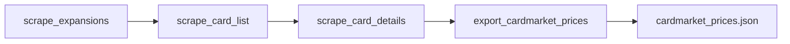
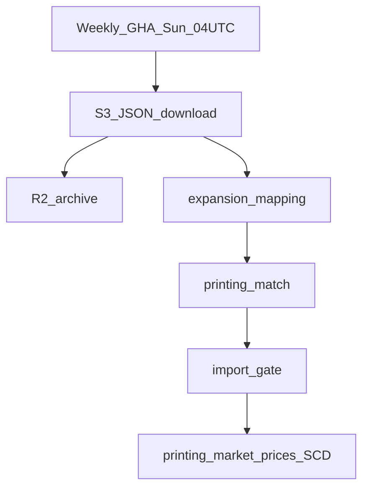

# I Stopped Scraping Cardmarket. Here's What I Built Instead.

*Suggested LinkedIn article title. Paste the body below into the article editor — see `article_linkedin_paste.txt` for the LinkedIn-safe version.*

---

If you collect trading cards, you probably know the feeling: you own a stack of cards and you want to know what they're worth. Not a vague guess — actual market numbers. LOW, average, trend.

I'm building a TCG collection tracker. Cardmarket is the go-to marketplace for European collectors, so their prices were the obvious source. There is no public API for hobby projects. So I did what many developers do first: I scraped the website.

This article is what I learned — for collectors who wonder why apps struggle with price data, and for developers facing the same wall. I'll cover the legacy scrape, why it broke, the replacement I shipped, and the messy matching rules that still cost me time.

---

## The problem: prices without an API

Cardmarket lists millions of products. Each card can have multiple printings (set + rarity), and each printing has its own price curve. My app stores cards by set code and rarity — the same way collectors think about their binders.

Cardmarket does not offer a documented REST API for third-party apps. Partner integrations exist, but not for a side project. The realistic options were: scrape HTML pages, or find another data path.

I chose scraping. It worked — until it didn't.

---

## The legacy approach: pretend to be a browser

Think of Cardmarket as a shop behind a security gate. Every page load is checked: are you a real person, or a bot harvesting prices?

My scraper walked that gate page by page. It fetched expansion lists, then product search results (paginated), then individual card detail pages with price fields. Four jobs in sequence:



**For developers:** the pipeline evolved from one monolithic script into resumable jobs with checkpoints every five expansions or cards. I tried multiple HTTP backends — cloudscraper, curl_cffi with saved Cloudflare cookies, and finally real Chrome via CDP when HTTP alone failed.

**Polite mode** meant roughly one request every twenty seconds, one worker, and fifteen to thirty seconds between expansions. A full catalog run took hours. It had to run on my home network — or a mobile hotspot when my home IP was banned. GitHub Actions datacenter IPs got HTTP 403 and 429 immediately. Cloud automation was off the table.

I also built incremental mode: diff the live expansion list, scrape only new sets, merge into existing JSON. Smarter — but still 100% dependent on not getting blocked.


---

## What went wrong

I spent weeks tuning retries, cookies, and browser profiles. The bottleneck was never parsing HTML. It was operations.


| Problem | What it meant in practice |
|---------|---------------------------|
| Cloudflare IP rate limits (HTTP 429, Error 1015) | My home IP got banned after aggressive runs. Rotating four browser profiles on the **same IP did not help** — it launched four Chromes and made things worse. |
| Scale | Hundreds of expansions, each with paginated product lists. "Three expansions succeeded" could mean nine separate page fetches, plus browser warmup. |
| Fragility | HTML layout changes break selectors. Cloudflare clearance cookies expire. |
| Ops burden | Manual login flows, hotspot IP switches, checkpoint resumes, one-hour ban waits. |
| CI impossible | No reliable way to run a full scrape from a cloud runner. |

One test I documented: home IP, HTTP 429 on every browser profile at warmup. Same scraper on a mobile hotspot at 0.05 requests per second: three expansions, 154 cards, nine page fetches, no 429.

The lesson was blunt: **scraping Cardmarket is an infrastructure problem dressed up as a parsing problem.**

---

## The pivot: official catalog JSON on S3

While digging through Cardmarket's site, I found something better than HTML: **bulk JSON files** on `downloads.s3.cardmarket.com`. Product catalog (singles and nonsingles) plus a price guide. Yu-Gi-Oh is game id `3`.

No Cloudflare. No HTML parsing. Download completes in minutes.



The new pipeline is one job: download JSON, map Yugipedia sets to Cardmarket expansions, match individual printings, validate, import. A GitHub Action runs it weekly on production. Raw catalogs and rejection reports land in object storage for debugging.

**What improved:**

- Reliable and automatable — runs in CI without IP roulette
- Complete price fields (trend, average, low) in one file
- No cookie babysitting
- Partial failure tolerance — a bad set logs a rejection and the job continues

The legacy scraper is archived. Deprecated job stubs print a migration message pointing to the catalog sync.


---

## The hard part: joining two catalogs

Downloading JSON was the easy win. The hard work is **matching**.

My card catalog comes from Yugipedia (set names, printings, rarities). Cardmarket has its own product IDs, expansion IDs, and naming conventions. The S3 files list products; my app needs rows keyed by `(set_code, rarity_code)`.

I built a two-stage matcher:

**Stage 1 — Expansion mapping.** For each TCG set in my database, find Cardmarket nonsingle products (booster boxes, tins, etc.) whose names contain the set name. That yields a Cardmarket `idExpansion`. Sounds simple. It isn't.

**Stage 2 — Printing + rarity.** Within that expansion, find singles matching each card name. When a card has multiple rarities in the same set, I don't get rarity from Cardmarket directly — I **infer it by sorting Cardmarket prices** against a rarity price-rank table. Cheapest listing pairs with the lowest-ranked rarity, and so on.

For developers, the core rarity logic is price-ordered pairing:

```
Sort Cardmarket singles by trend, then average price (ascending).
Sort Yugipedia printings by rarity rank (ascending).
Pair 1:1. If counts differ or two CM prices tie → reject that card.
```

This works surprisingly often. It fails when catalogs disagree on how many printings exist, or when two rarities share the same market price.

---

## Drawbacks: rules, aliases, and mapping debt

Official data removed the Cloudflare pain. It introduced **mapping debt** — dozens of rules I maintain by hand.


### Manual aliases (~40 set codes)

Generic "does the product name contain the set name?" fails for many classic products. I keep an alias table. Examples:

- `GLD4` → `Gold Series 4: Pyramids Edition Booster` (Yugipedia name doesn't substring-match)
- `STP5` → `Speed Duel: Tournament Pack 5 Booster` (Cardmarket uses a colon; Yugipedia doesn't)
- `SDWS` → `Structure Deck R: Warriors' Strike`

Every new edge case is a line of code, not a config toggle.

### Automatic exclusions and guards

- Skip entirely: championship prize cards, collectible tins, promotional/participation sets, sets with fewer than two Yugipedia cards
- Ignore nonsingle products tagged Rush Duel, OCG, Korea, short regional codes like `(MIP)`, damaged-condition markers
- Digit boundary: `OTS Tournament Pack 1` must not match `OTS Tournament Pack 10`
- Colon subtitle guard: `Legendary Duelists` must not match `Legendary Duelists: Ancient Millennium`
- Alternate name retries: flip Structure Deck titles, map `Dark Revelation Volume 3` → `Dark Revelation 3`, reorder Starter Deck names

### Expansion conflicts

Sometimes multiple Cardmarket expansions match one Yugipedia set. I validate candidates by checking whether singles and prices agree across expansions. Compatible → merge. Conflicting → reject the set and log it.

### Printing-match fragility

- Yugipedia printing count must equal Cardmarket single count per card — else reject
- Identical Cardmarket prices for two rarities → ambiguous order → reject
- Regional set codes (`LOD-078` vs `LOD-EN078`) collapse to one slot — Cardmarket has one listing for all
- Catalog drift between Yugipedia re-import and Cardmarket refresh causes count mismatches

The scraper's pain was **getting blocked**. The catalog pipeline's pain is **getting the join right**. I'd take the second problem every time — but I won't pretend it's solved.

---

## Lessons learned

**Check for official bulk exports before scraping.** Marketplaces often publish catalog files for partners or internal tools. They're rarely advertised as an API, but they're there.

**Scraping is an ops problem.** Rate limits, IP bans, cookie rotation, and "run it on your laptop" do not scale. Budget for that or don't scrape.

**Joining heterogeneous catalogs is often harder than fetching data.** The download is minutes. The matcher is months of edge cases.

**Design for partial success.** Per-set rejection reports beat all-or-nothing scrapes. One bad alias shouldn't kill the weekly sync.

**Archive, don't delete.** I kept the legacy scraper in an `archive/` folder. Future me — and future agents — need to know what failed and why.

---

## Where things stand now

The collection tracker gets weekly Cardmarket prices via automated catalog sync. Most sets map cleanly. A handful reject each run — logged, inspectable, fixable.

If I were starting again, I'd look for the S3 files on day one and invest in matching rules earlier. I'd also run dry-sync jobs in CI with fixture JSON so alias regressions show up in tests, not in production.

If you've solved similar catalog-join problems — two data sources, different naming, no shared IDs — I'd love to hear how you handled it in the comments.

---

*Cover image: `images/01_hero_cover.png`*
